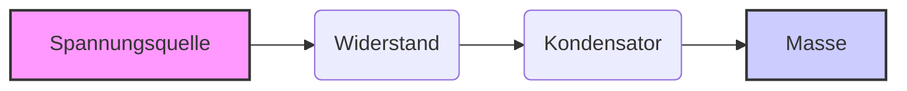
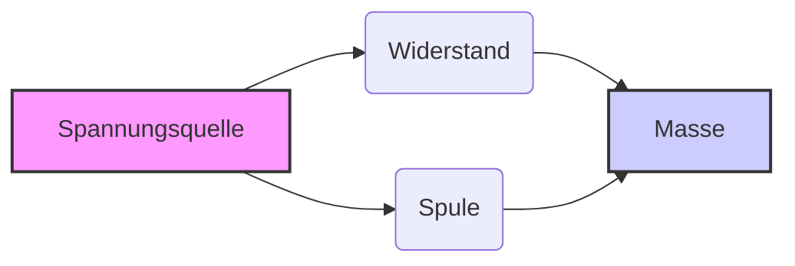

[[1.Syt]]
___
### Grundlagen

*   **Elektrische Ladung:** Die Grundlage aller elektrischen Phänomene. Es gibt positive und negative Ladungen.
*   **Strom (I):** Die Bewegung von elektrischer Ladung. Gemessen in Ampere (A).
    $I = \frac{dQ}{dt}$
*   **Spannung (U):** Die Potentialdifferenz zwischen zwei Punkten. Sie treibt den Stromfluss an. Gemessen in Volt (V).
    $U = \frac{dW}{dQ}$
*   **Widerstand (R):** Der Widerstand gegen den Stromfluss. Gemessen in Ohm (Ω).
    $R = \frac{U}{I}$ (Ohmsches Gesetz)
*   **Leistung (P):** Die Rate, mit der elektrische Energie umgewandelt wird. Gemessen in Watt (W).
    $P = U \cdot I = I^2 \cdot R = \frac{U^2}{R}$

### Bauelemente

*   **Widerstände:** Begrenzen den Stromfluss.
*   **Kondensatoren:** Speichern elektrische Energie in einem elektrischen Feld.
*   **Spulen (Induktivitäten):** Speichern elektrische Energie in einem magnetischen Feld.
*   **Dioden:** Lassen Strom nur in eine Richtung fließen.
*   **Transistoren:** Verstärken oder schalten elektronische Signale. (Bipolartransistoren, Feldeffekttransistoren)
*   **Integrierte Schaltungen (ICs):** Komplexe Schaltungen auf einem Chip.

### Schaltungen

*   **Reihenschaltung:** Bauelemente sind hintereinander geschaltet. Der Strom ist überall gleich, die Spannungen addieren sich.
*   **Parallelschaltung:** Bauelemente sind nebeneinander geschaltet. Die Spannung ist überall gleich, die Ströme addieren sich.
*   **Kirchhoffsche Gesetze:**
    *   **Knotenregel (1. Kirchhoffsches Gesetz):** Die Summe der Ströme in einem Knoten ist Null.
        $\sum I = 0$
    *   **Maschenregel (2. Kirchhoffsches Gesetz):** Die Summe der Spannungen in einer Masche ist Null.
        $\sum U = 0$
*   **Wechselstrom (AC):** Strom, der seine Richtung periodisch ändert.
*   **Gleichstrom (DC):** Strom, der konstant in eine Richtung fließt.

### Wichtige Themenbereiche

*   **Analoge Schaltungstechnik:** Verstärker, Filter, Operationsverstärker (OPV).
*   **Digitale Schaltungstechnik:** Logikgatter, Flip-Flops, Mikroprozessoren.
*   **Leistungselektronik:** Steuerung und Wandlung elektrischer Energie (z.B. Frequenzumrichter, Schaltnetzteile).
*   **Elektrische Maschinen:** Motoren und Generatoren.
*   **Messtechnik:** Messung elektrischer Größen mit Multimetern, Oszilloskopen etc.
*   **Automatisierungstechnik:** Steuerung von Prozessen mit speicherprogrammierbaren Steuerungen (SPS).
*   **Nachrichtentechnik:** Übertragung von Informationen über elektrische Signale.

### Formeln und Gesetze

*   **Ohmsches Gesetz:** $U = R \cdot I$
*   **Leistung:** $P = U \cdot I$
*   **Kapazität eines Kondensators:** $C = \frac{Q}{U}$
*   **Induktivität einer Spule:** $U = L \cdot \frac{dI}{dt}$
*   **Impedanz (Wechselstromwiderstand):** $Z = R + jX$ (wobei $X$ die Reaktanz ist)

### Nützliche Diagramme (Mermaid)

### Tipps für die Mitschrift

*   **Struktur:** Verwende Überschriften und Unterüberschriften, um den Stoff zu gliedern.
*   **Formeln:** Schreibe wichtige Formeln übersichtlich auf und markiere sie.
*   **Skizzen:** Zeichne Schaltpläne und Diagramme, um das Verständnis zu erleichtern.
*   **Beispiele:** Notiere dir Beispiele zu den verschiedenen Themen.
*   **Zusammenhänge:** Stelle Verbindungen zwischen den verschiedenen Themen her.
*   **Eigene Worte:** Formuliere die Inhalte in deinen eigenen Worten, um sie besser zu verstehen und zu behalten.
*   **Aktualität:** Ergänze deine Mitschrift regelmäßig mit neuen Informationen und Erkenntnissen.
