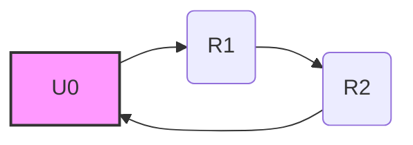

[[1.Syt]]
___
## Kirchhoffsche Gesetze

Die Kirchhoffschen Gesetze sind zwei grundlegende Regeln der Elektrotechnik, die zur Analyse von elektrischen Schaltungen verwendet werden. Sie basieren auf den Prinzipien der Ladungserhaltung und der Energieerhaltung.

### 1. Kirchhoffsches Gesetz: Knotensatz (Knotenregel, engl. Kirchhoff's Current Law - KCL)

*   **Aussage:** Die Summe aller Ströme, die in einen Knotenpunkt hineinfließen, ist gleich der Summe aller Ströme, die aus dem Knotenpunkt herausfließen. Anders ausgedrückt: Die algebraische Summe aller Ströme in einem Knoten ist Null.
*   **Mathematische Formulierung:**
    $\sum_{i=1}^{n} I_i = 0$
    Dabei ist $I_i$ der Strom durch den i-ten Zweig des Knotens. Ströme, die in den Knoten hineinfließen, werden üblicherweise positiv gezählt, Ströme, die aus dem Knoten herausfließen, negativ (oder umgekehrt, solange es konsistent gehandhabt wird).
*   **Bedeutung:** Der Knotensatz basiert auf dem Prinzip der Ladungserhaltung. Elektrische Ladung kann in einem Knoten weder erzeugt noch vernichtet werden.
*   **Anwendung:** Der Knotensatz wird verwendet, um die Ströme in den verschiedenen Zweigen einer Schaltung zu bestimmen.

### 2. Kirchhoffsches Gesetz: Maschensatz (Maschenregel, engl. Kirchhoff's Voltage Law - KVL)

*   **Aussage:** Die Summe aller Spannungen in einer geschlossenen Masche (Schleife) ist Null.
*   **Mathematische Formulierung:**
    $\sum_{i=1}^{n} U_i = 0$
    Dabei ist $U_i$ die Spannung über dem i-ten Bauelement in der Masche. Spannungen, die in einer bestimmten Richtung durchlaufen werden, werden positiv gezählt, Spannungen in der entgegengesetzten Richtung negativ (oder umgekehrt, solange es konsistent gehandhabt wird).
*   **Bedeutung:** Der Maschensatz basiert auf dem Prinzip der Energieerhaltung. Die Energie, die ein Ladungsträger beim Durchlaufen einer geschlossenen Masche aufnimmt, muss er auch wieder abgeben.
*   **Anwendung:** Der Maschensatz wird verwendet, um die Spannungen in den verschiedenen Zweigen einer Schaltung zu bestimmen.

### Anwendung der Kirchhoffschen Gesetze

1.  **Schritt 1: Schaltungsanalyse:**
    *   Identifiziere alle Knotenpunkte und Maschen in der Schaltung.
    *   Definiere die Stromrichtungen in jedem Zweig (willkürlich, aber konsistent).
    *   Definiere die Polarität der Spannungen über jedem Bauelement.
2.  **Schritt 2: Knotensatz anwenden:**
    *   Wende den Knotensatz auf jeden Knotenpunkt an, um Gleichungen für die Ströme zu erhalten.
    *   Achte darauf, dass die Anzahl der unabhängigen Knotengleichungen gleich der Anzahl der Knotenpunkte minus 1 ist.
3.  **Schritt 3: Maschensatz anwenden:**
    *   Wende den Maschensatz auf jede unabhängige Masche an, um Gleichungen für die Spannungen zu erhalten.
    *   Achte darauf, dass die Anzahl der unabhängigen Maschengleichungen so gewählt wird, dass zusammen mit den Knotengleichungen genügend Gleichungen vorhanden sind, um alle unbekannten Ströme und Spannungen zu bestimmen.
4.  **Schritt 4: Gleichungssystem lösen:**
    *   Löse das resultierende Gleichungssystem, um die unbekannten Ströme und Spannungen zu bestimmen.

### Beispiel

Betrachten wir eine einfache Schaltung mit zwei Widerständen ($R_1$, $R_2$) in Reihenschaltung an einer Spannungsquelle $U_0$.

1.  **Knoten:** Es gibt zwei Knotenpunkte (zwischen $U_0$ und $R_1$ sowie zwischen $R_2$ und $U_0$).
2.  **Masche:** Es gibt eine Masche.
3.  **Knotensatz:** An einem Knotenpunkt gilt: $I_{U_0} - I_{R_1} = 0$ und $I_{R_1} - I_{R_2} = 0$, also $I_{U_0} = I_{R_1} = I_{R_2} = I$.
4.  **Maschensatz:** $U_0 - U_{R_1} - U_{R_2} = 0$.
5.  **Ohmsches Gesetz:** $U_{R_1} = I \cdot R_1$ und $U_{R_2} = I \cdot R_2$.
6.  **Einsetzen:** $U_0 - I \cdot R_1 - I \cdot R_2 = 0 \Rightarrow U_0 = I \cdot (R_1 + R_2) \Rightarrow I = \frac{U_0}{R_1 + R_2}$.

### Zusammenfassung

*   Die Kirchhoffschen Gesetze sind grundlegende Regeln zur Analyse elektrischer Schaltungen.
*   Der Knotensatz basiert auf der Ladungserhaltung und besagt, dass die Summe der Ströme in einem Knoten Null ist.
*   Der Maschensatz basiert auf der Energieerhaltung und besagt, dass die Summe der Spannungen in einer Masche Null ist.
*   Die Kirchhoffschen Gesetze werden verwendet, um Gleichungssysteme aufzustellen, die zur Bestimmung von Strömen und Spannungen in einer Schaltung gelöst werden können.

### Mermaid Diagramm

