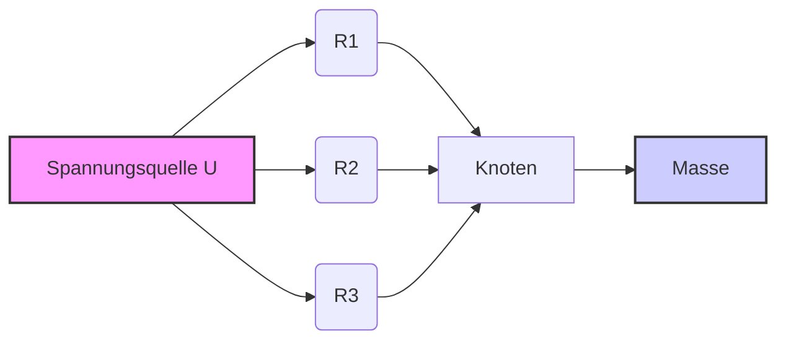

[[1.Syt]]
___
## Parallelschaltung von Widerständen

In einer Parallelschaltung sind zwei oder mehr Widerstände so miteinander verbunden, dass sie an beiden Enden den gleichen Knotenpunkt haben. Das bedeutet, dass an allen Widerständen die gleiche Spannung anliegt. Der Gesamtstrom teilt sich auf die einzelnen Widerstände auf.

### Eigenschaften der Parallelschaltung

*   **Gleiche Spannung:** Die Spannung $U$ ist an allen Widerständen gleich.
    $U = U_1 = U_2 = U_3 = ... = U_n$
*   **Stromteilung:** Der Gesamtstrom $I$ teilt sich auf die einzelnen Widerstände auf.
    $I = I_1 + I_2 + I_3 + ... + I_n$
*   **Gesamtwiderstand:** Der Gesamtwiderstand $R_{ges}$ ist kleiner als der kleinste Einzelwiderstand.

### Berechnung des Gesamtwiderstands

Der Kehrwert des Gesamtwiderstands ist gleich der Summe der Kehrwerte der Einzelwiderstände:

$\frac{1}{R_{ges}} = \frac{1}{R_1} + \frac{1}{R_2} + \frac{1}{R_3} + ... + \frac{1}{R_n}$

Für **zwei Widerstände** vereinfacht sich die Formel zu:

$R_{ges} = \frac{R_1 \cdot R_2}{R_1 + R_2}$

### Berechnung von Strömen und Spannungen

*   **Strom durch einen Widerstand:** Nach dem Ohmschen Gesetz:
    $I_i = \frac{U}{R_i}$ (wobei $I_i$ der Strom durch den Widerstand $R_i$ ist)
*   **Gesamtstrom:**
    $I = \frac{U}{R_{ges}}$
*   **Spannung:** Die Spannung ist an allen Widerständen gleich und entspricht der angelegten Spannung.

### Beispiel

Gegeben seien drei Widerstände in Parallelschaltung: $R_1 = 10 \Omega$, $R_2 = 20 \Omega$, $R_3 = 30 \Omega$.

1.  **Berechnung des Gesamtwiderstands:**

    $\frac{1}{R_{ges}} = \frac{1}{10} + \frac{1}{20} + \frac{1}{30} = \frac{6}{60} + \frac{3}{60} + \frac{2}{60} = \frac{11}{60}$

    $R_{ges} = \frac{60}{11} \approx 5.45 \Omega$

2.  **Annahme einer Spannung:** Nehmen wir an, die angelegte Spannung beträgt $U = 12V$.

3.  **Berechnung der Einzelströme:**

    $I_1 = \frac{12}{10} = 1.2 A$

    $I_2 = \frac{12}{20} = 0.6 A$

    $I_3 = \frac{12}{30} = 0.4 A$

4.  **Berechnung des Gesamtstroms:**

    $I = I_1 + I_2 + I_3 = 1.2 + 0.6 + 0.4 = 2.2 A$

    Alternativ: $I = \frac{U}{R_{ges}} = \frac{12}{60/11} = \frac{12 \cdot 11}{60} = \frac{132}{60} = 2.2 A$

### Zusammenfassung

*   In einer Parallelschaltung ist die Spannung an allen Widerständen gleich.
*   Der Gesamtstrom teilt sich auf die einzelnen Widerstände auf.
*   Der Gesamtwiderstand ist immer kleiner als der kleinste Einzelwiderstand.
*   Die Berechnung des Gesamtwiderstands erfolgt über die Kehrwerte der Einzelwiderstände.

### Mermaid Diagramm

