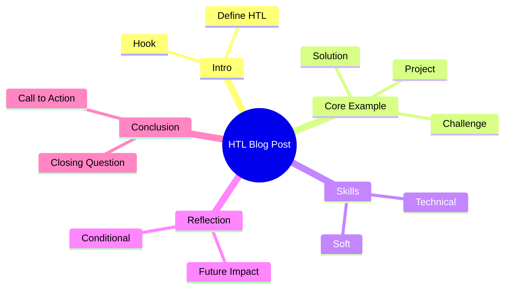

## Task
Write a blog post (approx. 350–450 words) for an international student tech blog. Your audience: students (15–18) curious about how technical education at an HTL prepares them for future careers. Use a personal yet informative tone.

## Choose ONE Focus Angle
1. How my HTL projects are shaping my future career goals  
2. The most valuable technical and soft skills I am developing at HTL  
3. A behind-the-scenes look at a recent project (e.g., robotics, software, electronics)  
4. Why practical engineering education matters in today’s world  
5. Balancing theory and practice: what makes HTL unique  

## Required Language Features (include all)
- At least:  
  - 2 relative clauses (which/that/who)  
  - 2 linking words for contrast (however/although/whereas)  
  - 1 conditional sentence Type 2 (If I had..., I would...)  
  - 1 passive construction (e.g., "is implemented", "was tested")  
  - 1 rhetorical question  
  - 1 short quotation (invented is fine) with attribution  
  - 1 modal of speculation (might/could/may)  
- Vary sentence length (mix of 8–12 word sentences and longer complex ones).

## Suggested Structure
1. Title (catchy, specific)  
2. Hook (question, statistic, brief anecdote)  
3. Context: What HTL is (brief, for international readers)  
4. Personal involvement or project example  
5. Skills gained (technical + soft)  
6. Reflection: impact on future or mindset  
7. Call to action or thought-provoking closing line  

## Tone Guidelines
- Engaging, reflective, not overly academic  
- Avoid long passive chains  
- Use first person singular (I) with occasional we if describing teamwork  

## Example Hook Techniques
- Statistic: "By the time I finish HTL, I will have completed X hours of lab work."  
- Rhetorical question: "What if your classroom felt more like a startup workshop?"  
- Micro-story: "Last winter, a sensor failure at 2 a.m. taught me more than a week of theory."  

## Useful Lexical Field (pick and integrate naturally)
- Technical: prototype, iteration, circuitry, deployment, automation, debugging, scalability, firmware  
- Process: constraint, efficiency, optimization, documentation, validation, integration  
- Soft skills: resilience, collaboration, accountability, initiative, adaptability  
- Future-facing: innovation, sustainability, emerging technologies, interdisciplinary, problem-solving  

## Transition / Cohesion Phrases
- Addition: moreover, furthermore, in addition  
- Contrast: however, nevertheless, although, whereas  
- Emphasis: notably, significantly, importantly  
- Result: therefore, consequently, as a result  
- Sequence: initially, subsequently, ultimately  

## Common Mistakes to Avoid
- Overusing "very" (replace with precise adjectives)  
- Starting too many sentences with "I"  
- Mixing present simple and present perfect incorrectly  
- Using German word order (watch placement of verbs)  

## Mini Rubric (Self-Check)
| Criterion | Excellent (✓) |
|-----------|---------------|
| Word count 350–450 |   |
| All required grammar features present |   |
| Clear paragraphing (5–7 paragraphs) |   |
| At least 8 topic-specific vocabulary items |   |
| Logical flow + cohesive devices |   |
| Minimal spelling/grammar errors |   |
| Engaging introduction & purposeful conclusion |   |

## Planning Template (Fill Before Writing)
Topic Choice:  
Working Title:  
Target Audience Intention (inform/inspire/reflect):  
Hook Type (question/stat/story):  
Project or Example to Highlight:  
3 Key Skills to Emphasize:  
Future Impact (1–2 sentences):  
Closing Strategy (call to action / reflection / prediction):  

## Sample Outline (Model Only—Do Not Copy)
Title: From Soldering Irons to Systems Thinking: My HTL Journey  
Hook: Rhetorical question + brief contrast  
Para 1: Explain HTL for outsiders  
Para 2: Specific project (problem → solution → result)  
Para 3: Technical skills (tools, processes)  
Para 4: Soft skills + teamwork quote  
Para 5: Reflection + conditional sentence + future outlook  
Conclusion: Call to explore hands-on learning globally  

## Mermaid Mindmap (Structure Guidance)

## Quick Grammar Reminders
- Conditional Type 2: If I had fewer labs, I would learn less.  
- Passive: The prototype was tested under simulated stress.  
- Relative clause: The board that we designed failed twice.  

## Optional Stretch Goals
- Include a metaphor (e.g., "Our lab is a sandbox for controlled failure.")  
- Use one balanced contrast sentence: "Although the deadline was brutal, the collaboration was energizing."  
- Integrate a statistic (real or plausible, labeled if estimated).  

When you are done, paste your draft here and I will give targeted feedback.