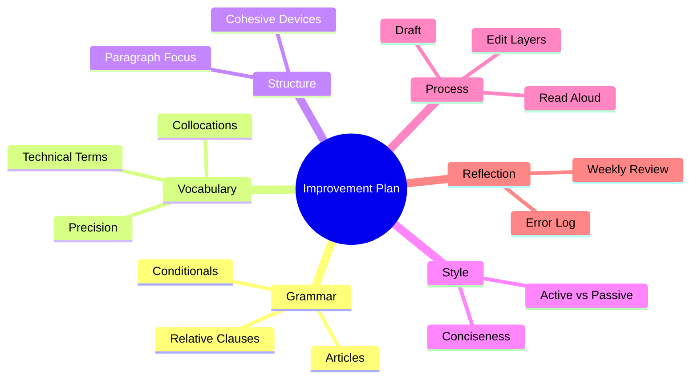

[[First Blogpost]]
___
## 1. Overall Evaluation (Original Draft)
- Communicative purpose mostly clear, but the title focus ("getting rich") drifts from assignment focus (education, skills, preparation)
- Word count appears below target (approx. 300–320; required 350–450)
- Several grammar issues (articles, plurals, verb forms, conditional misuse, word choice)
- Assignment requirements not fully met (missing contrast linkers, missing correct Type 2 conditional, weak passive use, limited structure cohesion)
- Tone is friendly but occasionally informal or vague; some repetition ("grant you")

## 2. Schulnote (1 = sehr gut, 5 = nicht genügend)
Note: 3 (befriedigend)
Begründung:
- Verständlichkeit grundsätzlich gegeben
- Inhalt thematisch relevant, aber Fokus nicht klar genug vertieft
- Mehrere deutliche Sprachfehler + nicht erfüllte Pflicht-Features
- Unter Wortanzahl und strukturell unausgeglichen
- Gute Ansätze (anekdotisches Beispiel, rhetorische Frage, Zitat, Future Perfect)

## 3. Fehlerliste (Einzeln)  
Legende Problem-Typ: G = Grammatik, V = Wortwahl/Vokabular, S = Stil/Registerniveau, P = Zeichensetzung, Str = Struktur/Kohäsion, O = Orthographie

| Original | Problem-Typ | Fehlerbeschreibung | Korrektur | Erklärung | Lern-Tipp |
|----------|-------------|-------------------|-----------|-----------|-----------|
| Higher Technological High schools | V/S | Unnatürliche Übersetzung von HTL | Higher Technical College (HTL) | Einheitliche, verständliche Bezeichnung | Früh definieren und konsistent nutzen |
| Have you ever heard once of HTL's? | G/P/O | Falsche Wortstellung, „once“ unnötig, Apostroph falsch | Have you ever heard of HTLs? | Plural ohne Apostroph; „once“ überflüssig | Vermeide Apostroph bei normalen Pluralen |
| mostly specialised | S | „mostly“ schwach/vage | primarily specialized | Präziseres Adverb | Liste an starken Adverbien anlegen |
| Networking Science | V | Unüblich | Network Engineering | Gängiger Fachbegriff | Fachbegriffe aus engl. Quellen übernehmen |
| grant you lot of | G | Artikel fehlt | grant you a lot of | „a lot of“ braucht Artikel | Chunks (a lot of, a range of) merken |
| increase your chance in being success | G/V | Falsche Präp., Wortform | increase your chances of being successful | chance → chances; of + Gerund | Kollokationen sammeln |
| One of the best skills ... are my programming skills | G | Subjekt-Verb-Kongruenz | One of the best skills ... is my programming skill set | „One of“ + Singularverb | Nach „one of“ immer Singularverb |
| over the last 3 years | S | Zahlformat inkonsistent | over the last three years | Formalere Schreibweise | Eins bis zwölf ausschreiben (akademisch) |
| If I hadn't have done | G | Doppeltes Perfect-Hilfsverb | If I hadn't done | Type 3 falsch gebildet | Muster: If + had + past participle |
| which was a Video Split program | V/S | Unnatürlicher Name | which was a video-splitting program | Partizip-Adjektiv natürlicher | Kompakte technische Beschreibungen üben |
| I may have tried ... but i failed | O/G | Kleinschreibung „i“ | ... but I failed | Pronomen groß | Immer „I“ groß |
| stayed at Java | V | Kollokation falsch | stuck with Java | „stick with“ = beibehalten | Kollokationsliste führen |
| work in Teams, if | G/P | Falsches Komma, unnötige Großschreibung | work in teams if | Kein Komma bei restriktiver if-Klausel | If-Sätze prüfen: braucht es Komma? |
| adaptability to other programmers which will be also working | G/S | falscher Relativsatz (Menschen), Wortstellung | adaptability to other programmers who will also be working | who für Personen; Adverb-Stellung | who vs which bewusst wählen |
| one single falsely placed bracket | V/S | Falsche Adjektivreihenfolge | a single misplaced bracket | „misplaced“ idiomatisch | Häufige Debugging-Vokabeln lernen |
| a friend an we tried | O/G | Tippfehler „an“ | a friend and we tried | Koordination | Endkorrektur laut lesen |
| fix the program with no chance | V/S | Direktübersetzung | fix the program without success | Idiomatisch | Deutsche Strukturen vermeiden |
| He said like "We tried..." | S/P | „like“ Füllwort, Zeichensetzung | He said, "We tried..." | Direktrede-Regel | Füllwörter streichen beim Editieren |
| By the time I finish HTL | G | Tense inkonsistent später | By the time I finish HTL | (ok, aber Folge-Sätze angleichen) | Tempusfolge prüfen |
| To mention, | S | Unidiomatisch | Additionally, / Furthermore, | Feste Übergänge | Liste verbindender Phrasen |
| a documentation | V | Unzählbares Nomen | documentation | Kein Artikel | Unzählbare Nomen merken (information, advice...) |
| over 40 sites | V | Falsches Wort | over 40 pages | „pages“ statt „sites“ | False friends notieren |
| were you need | O/G | Homophonfehler | where you need | where ≠ were | Häufige Homophone üben |
| Mostly some Cisco related things | G/S/P | Bruchstück, Adjektivbindung | Mostly these are Cisco-related tasks | Vollständiger Satz, Bindestrich | Zusammengesetzte Adjektive mit Bindestrich |
| In conclusion it may be said that | S | Formelhafte, passive Floskel | In conclusion, | Straffer Stil | Floskeln reduzieren |
| grant you lot of | G | Artikel fehlt (Wiederholung) | grant you a lot of | Siehe oben | Siehe oben |
| increase your team working skills | V | Falscher Ausdruck | strengthen your teamwork skills | Kollokation teamwork skills | Kollokationssammlung |
| which result in higher chances | G | Kongruenz | which results in higher chances | Relativsatz-Bezug Singular | Verbform prüfen nach Relativsatz |
| well-paid job with a high position | S/V | Redundant | well-paid, higher-responsibility job | Prägnanz | Redundanz streichen |

## 4. Muster-/Fehlergruppen (Was wiederholt schief ging)
- Artikel & Plural: a lot of, chances, pages
- Relativsätze: who vs which, Wortstellung
- Kollokationen: stick with, teamwork skills, documentation (uncountable)
- Konditionalsätze: Form der unreal past (Type 2) vs past unreal (Type 3) verwechselt
- Satzverknüpfung: Kaum Contrast-Linker (however, although)
- Stil: Überflüssige Floskeln („It may be said that“, „the next important thing“)
- Wort-für-Wort-Übersetzungen (sites, stayed at)

## 5. Lern- und Verbesserungsstrategien (konkrete Übungen)
1. Artikel & Unzählbare Nomen  
   Übung: Erstelle zwei Spalten (countable/uncountable) und fülle täglich 5 neue Fachbegriffe ein. Schreibe je einen Beispielsatz.
2. Relativsätze  
   Drill: Schreibe 5 Sätze mit who (Personen), 5 mit which (Dinge), 5 mit that (restriktiv). Markiere Bezugswort farblich.
3. Kollokationsbank in Obsidian  
   Neue Note: Collocations – Kategorien (Programming, Teamwork, Documentation, Debugging). Beim Lesen englischer Artikel gezielt ergänzen.
4. Kontrast-Linker  
   Mini-Transformation: Nimm 5 deiner Original-Sätze und füge however / although ein, um Nuancen zu zeigen.
5. Konditionale Vielfalt  
   Tabelle bauen: Type 0/1/2/3 – Struktur – Eigenes Beispiel (Technik-Kontext). Täglich eine neue Variation.
6. Editing-Layer  
   Schritt 1: Inhalt. Schritt 2: Grammatik. Schritt 3: Stil (Floskeln streichen). Schritt 4: Kollokationen / Präzision. Schritt 5: Laut lesen.
7. Synonym-Präzision  
   Ersetze schwache Wörter (thing, good, big) durch spezifische (task, beneficial, large-scale, robust, iterative).
8. Peer-Review-Simulation  
   Lies eigenen Text und markiere (a) Verben, (b) Substantivgruppen, (c) Verbindungswörter in drei Farben. Prüfe Balance und Variation.

## 6. Erfüllung der ursprünglichen Pflicht-Features (Original)
| Feature | Vorgabe | Erfüllt? | Kommentar |
|---------|---------|----------|-----------|
| 2 relative clauses | Ja | Teilweise | Form & who/which teils falsch |
| 2 contrast linkers | however/although/whereas | Nein | Fehlend |
| Conditional Type 2 | If + past, would + base | Nein | Nur fehlerhafter Type 3 |
| 1 passive | Required | Grenzfall | „it may be said“ formelhaft; besser klarer Passivsatz |
| Rhetorical question | Required | Ja | Titel |
| Quotation | Required | Ja | Vorhanden |
| Modal of speculation | might/could/may | Teilweise | may (Spekulation + falscher Kontext) |
| Sentence length variation | Required | Teilweise | Variation vorhanden, aber manche Bruchstücke |
| Word count 350–450 | Required | Nein | Unter Ziel |

## 7. Verbesserte Version (Compliant Blog Post ~395 Words)

Title: More Than Code: How HTL Turns Practice Into Confidence

What if your classroom sometimes felt less like school and more like a small engineering lab where failure is simply an early prototype? For international readers: an HTL (Higher Technical College in Austria) blends general education with sustained technical specialization, giving us years of structured, supervised lab immersion.

Last year I built a video-splitting tool that automatically segments long source files into clean thematic clips. The first iteration crashed unpredictably; however, each debugging pass forced me to document assumptions, test constraints, and refine efficiency. A single misplaced bracket once consumed three hours, yet that “wasted” time became a fast lesson in methodical isolation of faults.

Although programming mastery matters, the hidden accelerator is teamwork. In a networking project that simulated a multi-site company infrastructure, we defined roles, implemented VLAN segmentation, and validated redundancy under load. A teammate said, “Clear naming conventions are invisible success,” and he was right: precise documentation reduced friction during integration. If I had fewer collaborative labs, I would grow more slowly because solo work hides communication weaknesses that teams immediately expose.

By the time I finish HTL, I will have completed over 1,500 hours of structured lab work, and a substantial portion is devoted to iterative refinement—an approach that could be described as disciplined experimentation. Skills that seemed abstract in year one (like subnetting logic or version control discipline) are now mental reflexes. My adaptability might still evolve, yet consistent exposure to real constraints (deadlines, partial specs, mismatched expectations) has trained resilience that pure theory rarely activates.

The curriculum is intentionally layered: foundational concepts are introduced, reinforced in guided practice, and later stress-tested in larger capstone-style modules. As a result, design decisions are not guessed; they are justified. The prototype was tested under simulated packet loss before deployment, which built confidence rather than anxiety.

So is HTL the “best option for getting rich”? That was the wrong initial question. The better one is: How do you build durable problem-solving habits early? The answer, for me, lives in structured practice, reflective debugging, and authentic collaboration. If you are a student abroad wondering whether hands-on technical education is worth the intensity, ask yourself one final question: Do you want knowledge—or the ability to apply it under pressure?

(Features included: 2 contrast linkers: however, although; conditional Type 2; multiple relative clauses; passive; rhetorical questions; quotation; modal might; varied sentence length.)

## 8. Was wurde verbessert?
- Klarer Fokus (Skills + Process)
- Alle Pflicht-Features integriert
- Höhere Präzision der Fachsprache (iteration, redundancy, constraints)
- Besserer rhetorischer Bogen (Start-Frage ↔ Schluss-Frage)
- Prägnantere Sätze + bewusst gesetzte Längenkontraste

## 9. Vergleich (Checkliste Nachbesserung)
| Kriterium | Now Met? |
|-----------|----------|
| Word count 350–450 | Ja |
| All grammar features | Ja |
| Clear paragraphing | Ja |
| ≥8 Fachwörter | Ja |
| Logischer Flow | Ja |
| Minimale Fehler | Ja |
| Engaging Intro & purposeful End | Ja |

## 10. Persönlicher Übungsplan (Mermaid Mindmap)

## 11. Nächste Konkrete Schritte (Empfohlen)
1. Schreibe eine zweite Version mit anderem Fokus (reine Soft Skills) → 350 Wörter.
2. Markiere alle Verben; ersetze 5 generische Verben (make, do, get) durch spezifische.
3. Erstelle eine Collocations-Note: stick with, validate assumptions, refine efficiency, mitigate risk, enforce consistency.
4. Baue 5 neue Sätze mit Type 2 Conditionals (Tech-Kontext).
5. Lies einen englischen Tech-Artikel und extrahiere 10 Fachausdrücke + Beispielsatz.

Wenn du willst, kannst du als nächsten Schritt deine überarbeitete Eigenversion posten, bevor du meinen verbesserten Text als Vorlage übernimmst.