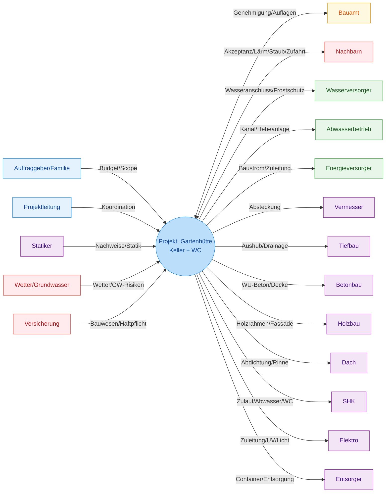
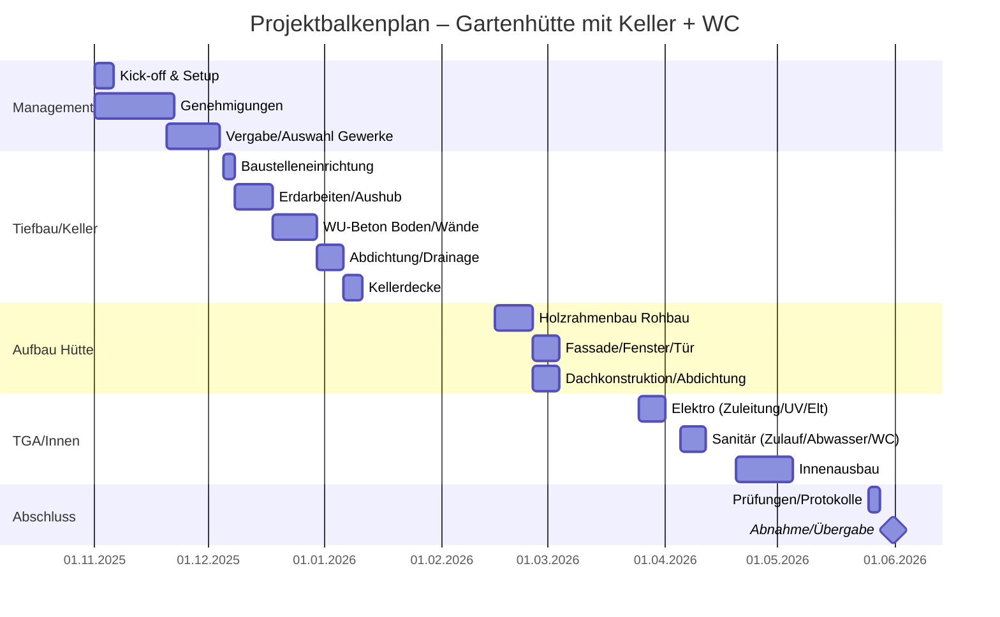
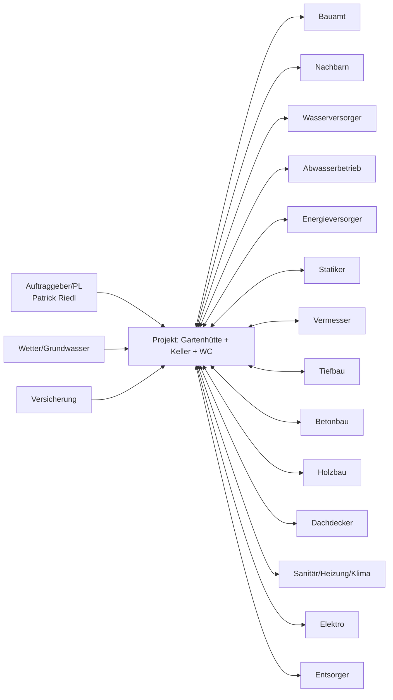
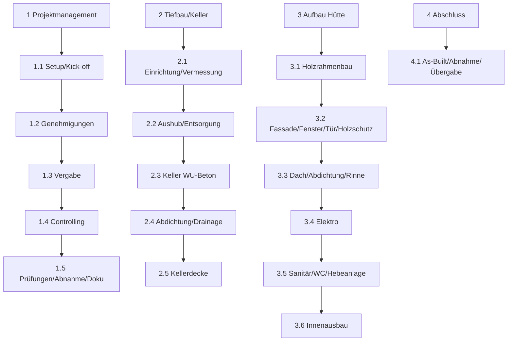
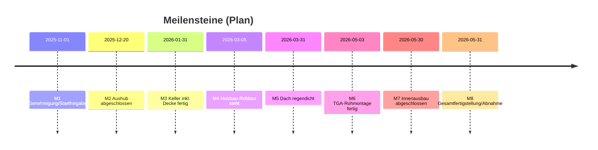
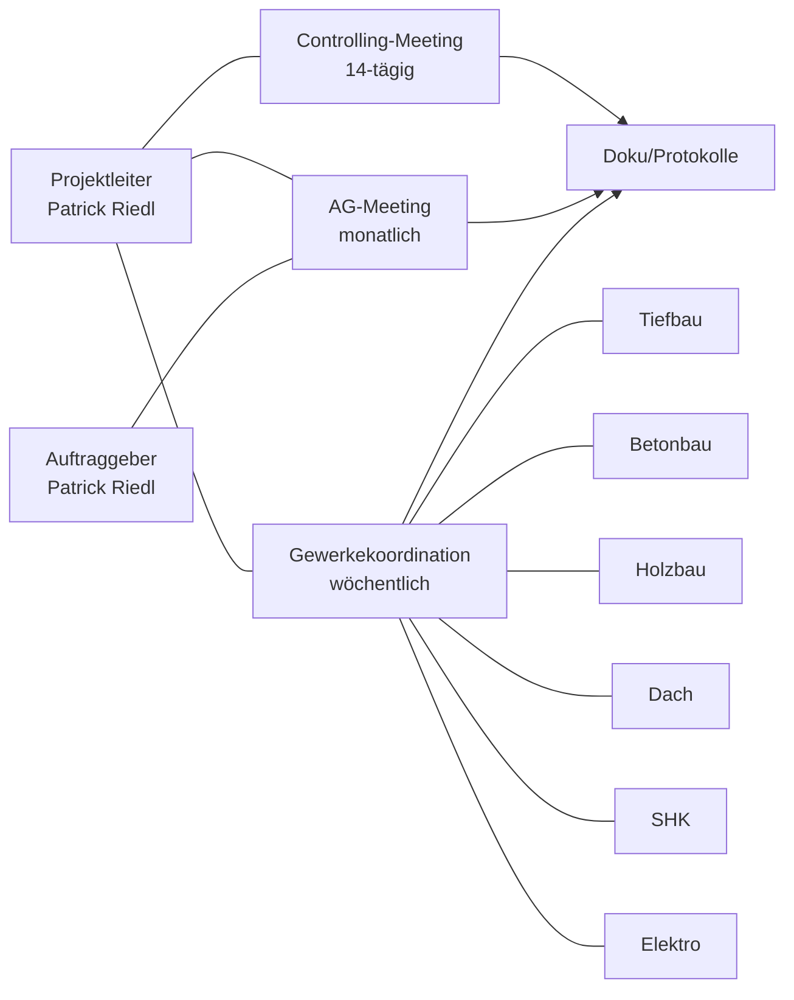
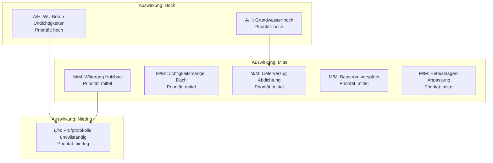
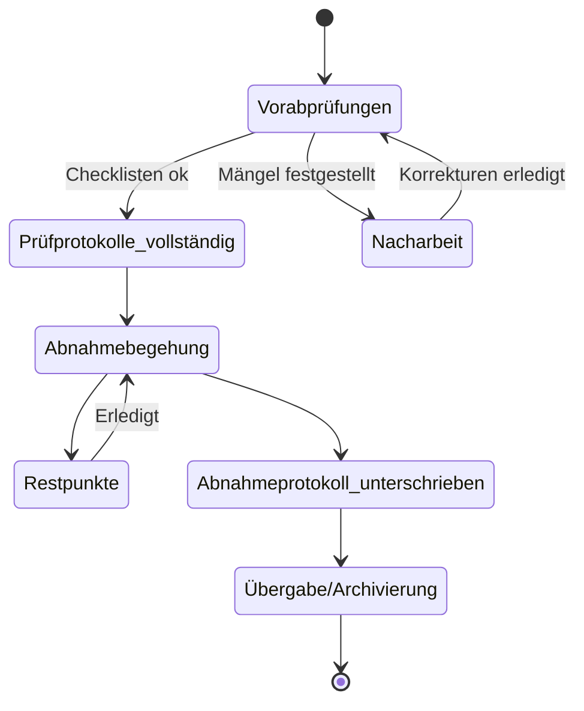

[[4.ITP2]]
___
# Projekthandbuch
Version: **0.67**  
Projektleiter/in: **Patrick Riedl**  
Datum: **14.10.2025**

## Inhalt
- 1 Projektpläne
  - 1.1 Projektauftrag
  - 1.2 Projektzieleplan
  - 1.3 Beschreibung Vorprojekt- und Nachprojektphase
  - 1.4 Projektumwelt-Analyse
  - 1.5 Beziehungen zu anderen Projekten und Zusammenhang mit den Unternehmenszielen
  - 1.6 Projektorganigramm
  - 1.7 Betrachtungsobjekteplan
  - 1.8 Projektstrukturplan
  - 1.9 Arbeitspaket-Spezifikationen
  - 1.10 Projektfunktionendiagramm
  - 1.11 Projektmeilensteinplan
  - 1.12 Projektbalkenplan
  - 1.13 Projektpersonaleinsatzplan
  - 1.14 Projektkostenplan
  - 1.15 Projektkommunikationsstrukturen
  - 1.16 Projekt-„Spielregeln“
  - 1.17 Projektrisikoanalyse
  - 1.18 Projektdokumentation
- 2 Projektstart
  - 2.1 Protokolle – Projektstart
- 3 Projektkoordination
  - 3.1 Abnahme Arbeitspakete
  - 3.2 Protokolle – Projektkoordination
- 4 Projektcontrolling
  - 4.1 Aktueller Projektfortschrittsbericht
  - 4.2 Weitere Projektfortschrittsberichte
  - 4.3 Protokolle – Projektcontrolling
- 5 Projektabschluss
  - 5.1 Projektabschlussbericht
  - 5.2 Protokolle – Projektabschluss

---

## Änderungsverzeichnis
| Versionsnummer | Datum      | Änderung                                               | Ersteller     |
|----------------|------------|--------------------------------------------------------|---------------|
| 0.67           | 14.10.2025 | Erstbefüllung des Projekthandbuchs (komplett befüllt) | Patrick Riedl |

---

## Ansprechpartner
| Name                         | Organisationseinheit               | Rolle im Projekt                    | Telefon          | E-Mail                               |
|------------------------------|------------------------------------|-------------------------------------|------------------|---------------------------------------|
| Riedl Patrick                | —                                  | Projektleiter, Auftraggeber         | +67 676767676767 | 220227@studierende.htl-donaustadt.at |
| Magistrat – Bauamt           | Stadtverwaltung                    | Genehmigungsbehörde                 | +43 1 1000 0     | bauamt@stadt.example                  |
| Abwasserbetrieb – Kundenservice | Stadtentwässerung               | Kanalanschluss/Entwässerung         | +43 1 2000 0     | kanal@stadt.example                   |
| Wasserversorger – Technik    | Stadtwerke Wasser                  | Wasseranschluss                     | +43 1 3000 0     | wasser@stadtwerke.example             |
| Energieversorger – Netz      | Netzbetreiber Strom                | Baustrom/Zuleitung                  | +43 1 4000 0     | netz@stromnetz.example                |
| Dipl.-Ing. Max Mustermann    | Statikbüro Mustermann GmbH        | Statik/Tragwerksplanung             | +43 1 555 11 22  | office@statik-mustermann.example      |
| Ing. Anna Beispiel           | Vermessung Beispiel KG            | Vermessung/Absteckung               | +43 1 555 22 33  | kontakt@vermessung-beispiel.example   |
| Tiefbau Mustermann GmbH      | Tief- und Erdbau                   | Erdarbeiten/Drainage                | +43 1 700 10 10  | office@tiefbau-mustermann.example     |
| Betonbau Steiner GmbH        | Betonbau                           | Keller WU-Beton/Decke               | +43 1 700 20 20  | kontakt@betonbau-steiner.example      |
| Zimmerei Holz&Haus OG        | Holzbau                            | Holzrahmenbau/Fassade               | +43 1 700 30 30  | hallo@holzhau.example                 |
| Dachdeckerei Regenfest KG    | Dachdecker                         | Dachabdichtung/Rinne                | +43 1 700 40 40  | service@regenfest.example             |
| SHK Frisch & Klar GmbH       | Sanitär/Heizung/Klima              | Wasser/Abwasser/WC/Hebeanlage       | +43 1 700 50 50  | office@frisch-klar.example            |
| Elektro Lichtblick GmbH      | Elektroinstallationen              | Zuleitung/UV/Licht/Steckdosen       | +43 1 700 60 60  | support@lichtblick-elektro.example    |
| Entsorger CleanBox GmbH      | Container/Entsorgung               | Entsorgung/Container                | +43 1 700 70 70  | dispo@cleanbox.example                |
| Bodengutachter GeoCheck OG   | Geotechnik                         | Bodengutachten/Grundwasser          | +43 1 700 80 80  | info@geocheck.example                 |
| Versicherung BauPlus AG      | Versicherung                       | Bauwesen/Haftpflicht                | +43 1 700 90 90  | kundenservice@bauplus.example         |
| Projektcoach (optional)      | —                                  | Methodik/Review                     | +43 1 123 45 67  | coach@example.org                     |

---

# 1 Projektpläne

## 1.1 Projektauftrag
| Feld                       | Inhalt                                                                                                                                                                                                                                                                                                                                                                                                |
|---------------------------|-------------------------------------------------------------------------------------------------------------------------------------------------------------------------------------------------------------------------------------------------------------------------------------------------------------------------------------------------------------------------------------------------------|
| Projekt                   | Gartenhütte (ca. 20 m²) in Holzrahmenbau mit Keller (ca. 20 m²) und WC                                                                                                                                                                                                                                                                                                                                |
| Projektstartereignis      | 01.11.2025 – Startfreigabe/Genehmigungsbestätigung liegt vor                                                                                                                                                                                                                                                                                                                                           |
| Projektstarttermin        | 01.11.2025                                                                                                                                                                                                                                                                                                                                                                                             |
| Inhaltliches Projektende  | Hütte fertiggestellt; Keller trocken, dauerhaft abgedichtet und zugänglich; WC funktionsfähig (Dichtheits-/Druckprobe bestanden); Elektro-Grundinstallation (Licht/Steckdosen) in Betrieb; vollständige Dokumentation (Pläne, Fotos, Prüfprotokolle)                                                                                                                                                 |
| Formales Projektende      | Abnahmeprotokoll unterzeichnet; Bestands-/Revisionsunterlagen übergeben; Prüfprotokolle (Abwasser Dichtheit, Wasser Druckprobe, Elektro-Erstprüfung) abgelegt; Schlussrechnung bezahlt; Projekt archiviert                                                                                                                                                                                            |
| Zieltermine               | Keller inkl. Decke: 31.01.2026 • Holzbau + Dach dicht: 31.03.2026 • Sanitär/Elektro/Innenausbau: 30.05.2026 • Gesamtfertigstellung/Abnahme: 31.05.2026                                                                                                                                                                                                                                               |
| Projektziele              | Genehmigungskonforme Hütte; Keller in WU‑Beton, dauerhaft dicht; WC inkl. Entlüftung/Frostschutz; regendichtes Dach (EPDM/Bitumen) mit Rinne/Entwässerung; Elektro-Grundinstallation (FI/LS, Licht, mind. 4–6 Steckdosen, Außensteckdose/-licht); Einhaltung aller Auflagen/Normen; Termine und Budget einhalten; vollständige Abnahme/Dokumentation                                                  |
| Nicht-Ziele               | Keine Wohnnutzung/Beherbergung; keine Heizung/Wohnraumdämmung über Grundniveau; keine PV-/Smart-Home-Umsetzung im Projektumfang; keine aufwendige Gartengestaltung                                                                                                                                                                                                                                   |
| Hauptaufgaben (Phasen)    | Planung/Statik/Genehmigungen • Baustelleneinrichtung/Vermessung • Erdarbeiten/Aushub/Entsorgung • Keller (Bodenplatte/Wände WU‑Beton, Abdichtung/Drainage, Decke) • Holzrahmenbau/Fassade/Fenster/Tür/Holzschutz • Dachkonstruktion/Abdichtung/Rinne • Sanitär (Zulauf/Abwasser/Hebeanlage/WC) • Elektro (Zuleitung/UV/Licht/Steckdosen) • Innenausbau • Außenmaßnahmen • Prüfungen/Abnahme/Übergabe |
| Ressourcen & Kosten (Plan)| Planung/Genehmigung/Abgaben 3.500 € • Erdarbeiten/Aushub/Entsorgung 4.200 € • Keller WU‑Beton 8.000 € • Abdichtung/Drainage 2.000 € • Kellerdecke 3.000 € • Holzrahmenbau 7.000 € • Dach 2.400 € • Fenster/Tür 2.000 € • Sanitär 3.700 € • Elektro 1.600 € • Innenausbau 2.000 € • Außen 600 € • Geräte/Container 600 € • Baustelleneinrichtung 500 € • Reserve 4.110 € • Summe 45.210 € |
| Rollen/Personen           | Auftraggeber: Patrick Riedl • Projektleiter: Patrick Riedl • Ausführung: externe Gewerke lt. Ansprechpartner                                                                                                                                                                                                                                                                                          |
| Budgetkategorie           | A (bis 0,3 Mio €)                                                                                                                                                                                                                                                                                                                                                                                      |

---

## 1.2 Projektzieleplan
| Zielart     | Projektziele (Detail)                                                                                                                                                                                                                                                                                            | Adaptierte Projektziele (bei Bedarf)                                                                                                                              |
|-------------|------------------------------------------------------------------------------------------------------------------------------------------------------------------------------------------------------------------------------------------------------------------------------------------------------------------|--------------------------------------------------------------------------------------------------------------------------------------------------------------------|
| Ziele       | Einbruchhemmende Tür, isolierverglaste Fenster • Leerrohre für spätere PV/Smart‑Home • Innen: Regale/Arbeitsfläche, robuster Bodenbelag • Außen: kleines Vordach, einfache Zuwegung, optional Regenwassernutzung für Garten (ohne WC) • Passive Kellerlüftung/Feuchtesteuerung                                    | Kellerlichte Höhe 2,30 m → 2,10 m (Grundwasser/Statik) • WC-Abwasser über Hebeanlage statt Freigefälle • Gründach entfällt (EPDM bleibt) • Fassade Lärche • Reserve 12% |
| Nicht-Ziele | Keine Wohnnutzung, keine vollwertige Heizung, keine PV-/Smart‑Home-Implementierung, keine aufwendige Gartengestaltung                                                                                                                                                                                                                                  | —                                                                                                                                                                  |

---

## 1.3 Beschreibung Vorprojekt- und Nachprojektphase
| Phase            | Inhalte/Ergebnisse                                                                                                                                                                                                                                                                                                                                                                                    |
|------------------|--------------------------------------------------------------------------------------------------------------------------------------------------------------------------------------------------------------------------------------------------------------------------------------------------------------------------------------------------------------------------------------------------------|
| Vorprojektphase  | Bedarf (Lager/Arbeitsraum + WC) geklärt • Standort inkl. Abstandsflächen/Leitungszonen fixiert • Bauweise (Holz + Keller WU‑Beton) entschieden • Genehmigungspflicht/ Auflagen geklärt • Entwässerung (Kanal, Alternative Hebeanlage) geprüft • Budget-/Terminrahmen definiert • Logistik (Zufahrt, Container, Kran) vorbereitet • Dokumente: Lageplan, Leitungspläne, Bodengutachten, Vorstatik, Angebote |
| Nachprojektphase | Wartung: Holzschutz 3–5 Jahre; Dach/Rinnen jährlich • WC/Hebeanlage jährliche Funktionskontrolle; Winterentleerung • As‑Built‑Dokumentation/Archivierung • 12‑Monats‑Mängelbegehung/Restpunkte • Optionale Folgeprojekte: PV‑Insel für Licht, Regalsystem, Außenpflasterung                                                                                                                            |

---

## 1.4 Projektumwelt-Analyse
| Umwelten            | Beziehung (Potential/Konflikt)                           | Maßnahmen                                                                 | Wer/Wann (PSP) |
|---------------------|-----------------------------------------------------------|---------------------------------------------------------------------------|----------------|
| Bauamt              | Genehmigung/Auflagen, Fristen                             | Vollständige Einreichung; Nachforderungen binnen 5 AT bearbeiten          | PL – 1.2       |
| Nachbarn            | Lärm/Staub/Zufahrt, Akzeptanz                             | Infobrief; Bauzeiten 08–17 Uhr; Sauberkeit; Kontakttelefon                | PL – 1.1       |
| Wasserversorger     | Wasseranschluss/Frostschutz                               | Terminkoordination; Absperr-/Entleerungsplan                              | SHK – 3.5      |
| Abwasserbetrieb     | Kanalanschluss/Hebeanlage                                 | Technische Freigabe; Revisionsschacht; Rückstauschutz                     | SHK – 3.5      |
| Energieversorger    | Baustrom/Zuleitungskapazität                              | Baustrom rechtzeitig anmelden; Provisorium                                | Elektro – 3.4  |
| Statiker            | Nachweise/Details                                         | Knoten/Bemusterung vor Fertigung; Änderungsmanagement                     | PL – 1.2       |
| Entsorger/Deponie   | Container/Abfuhr                                           | Rahmenvertrag; fixe Abholtage; Abfalltrennung                             | PL – 2.1       |
| Wetter/Grundwasser  | Regen/Frost/hoher GW-Spiegel                               | Terminpuffer; Wasserhaltung; Drainagekonzept                               | PL – 1.1       |
| Versicherung        | Schadensfälle/Bauwesen                                     | Policen prüfen; Meldewege definieren                                      | PL – 1.1       |

---

## 1.5 Beziehungen zu anderen Projekten und Zusammenhang mit den Unternehmenszielen
### Beziehungen zu anderen Projekten
| Programme/Projekte/Kleinprojekte | Beziehung (Potential/Konflikt) | Maßnahmen                        | Wer/Wann (PSP) |
| -------------------------------- | ------------------------------ | -------------------------------- | -------------- |
| Gartenorganisation/Regalsystem   | Synergie Innenausbau           | Maße/Schnittstellen abstimmen    | Holzbau – 3.6  |
| PV‑Insel (optional)              | Vorbereitung Leerrohre         | Leerrohre jetzt mitverlegen      | Elektro – 3.4  |
| Außenpflasterung                 | Logistik/Zufahrt               | Reihenfolge/Termine koordinieren | PL – 2.1       |
|                                  |                                |                                  |                |

### Zusammenhang zu den Unternehmenszielen
| Zielsetzung                            | Beschreibung des Zusammenhangs                                        |
| -------------------------------------- | --------------------------------------------------------------------- |
| Werterhalt/Steigerung der Liegenschaft | Dauerhafte, genehmigungskonforme Ausführung samt Dokumentation        |
| Sicherheit und Compliance              | Normkonforme Prüfungen (Elektro, Wasser, Abwasser) reduzieren Risiken |
| Effizienz/Ordnung                      | Zusätzlicher Lager-/Arbeitsraum strukturiert Gartenarbeit             |
| Nachhaltigkeit                         | Holzbauweise, langlebige Abdichtung, optionale Regenwassernutzung     |

---

## 1.6 Projektorganigramm
| Projektrolle            | Aufgabenbereiche/Skills                                               | Name/Unternehmen           |
|-------------------------|-----------------------------------------------------------------------|----------------------------|
| ProjektauftraggeberIn   | Budget/Scope/Abnahme                                                  | Patrick Riedl              |
| ProjektleiterIn         | Planung, Koordination, Controlling, Kommunikation                     | Patrick Riedl              |
| Projektteammitglieder   | Ausschreibung, Angebote, Terminkoordination                           | Patrick Riedl              |
| ProjektmitarbeiterInnen | Ausführung durch Gewerke; Qualität/Sicherheit                         | Externe Firmen (siehe oben)|
| Projektcoach (optional) | Methodik/Review                                                       | n.n.                       |

```mermaid
flowchart TB
  %% Klassen
  classDef ag fill:#fff3e0,stroke:#fb8c00,color:#e65100,font-weight:bold
  classDef pl fill:#e3f2fd,stroke:#1e88e5,color:#0d47a1,font-weight:bold
  classDef team fill:#ede7f6,stroke:#8e24aa,color:#4a148c
  classDef ext fill:#e8f5e9,stroke:#43a047,color:#1b5e20
  classDef coach fill:#fce4ec,stroke:#d81b60,color:#880e4f

  %% Kernrollen (Labels in Anführungszeichen + \n)
  AG["Projektauftraggeber\nPatrick Riedl"]:::ag
  PL["Projektleiter\nPatrick Riedl"]:::pl
  TEAM["Projektteammitglied(er)\nPatrick Riedl"]:::team
  CO["Projektcoach (optional)"]:::coach

  %% Hierarchie
  AG --> PL --> TEAM
  PL-.Methodik/Review.->CO

  %% Externe Gewerke
  subgraph "Externe Gewerke (Ausführung)"
    direction TB
    VER["Vermessung Beispiel KG"]:::ext
    TIEF["Tiefbau Mustermann GmbH"]:::ext
    BET["Betonbau Steiner GmbH"]:::ext
    HOLZ["Zimmerei Holz&Haus OG"]:::ext
    DACH["Dachdeckerei Regenfest KG"]:::ext
    SHK["SHK Frisch & Klar GmbH"]:::ext
    ELEKTRO["Elektro Lichtblick GmbH"]:::ext
    ENT["Entsorger CleanBox GmbH"]:::ext
    STAT["Statikbüro Mustermann GmbH"]:::ext
  end

  %% Berichtslinien
  PL --> VER
  PL --> TIEF
  PL --> BET
  PL --> HOLZ
  PL --> DACH
  PL --> SHK
  PL --> ELEKTRO
  PL --> ENT
  PL --> STAT

  %% Optional gestrichelt: Coach
  style CO stroke-dasharray:4 3
```

---

## 1.7 Betrachtungsobjekteplan
| Betrachtungsobjekt            | Beschreibung/Abnahmekriterium                                          |
|------------------------------|-------------------------------------------------------------------------|
| Genehmigungsunterlagen       | Bescheid inkl. Auflagen liegt vor                                      |
| Keller (WU‑Beton)            | Dicht; Abdichtung/Drainage korrekt; Decke gemäß Statik                 |
| Gartenhütte (Holzrahmenbau)  | Maßhaltig; Fassade/Fenster/Tür korrekt; Holzschutz aufgebracht         |
| Dach                         | Tragwerk; EPDM/Bitumen dicht; Rinne/Entwässerung funktionsfähig        |
| Sanitär/WC/Hebeanlage        | Dichtheits-/Druckproben bestanden; Betriebssicherheit                  |
| Elektro                      | FI/LS; Beleuchtung; Steckdosen; Prüf-/Messprotokoll                    |
| Innenausbau                  | Dämmung leicht, Innenverkleidung, Boden robust                         |
| Dokumentation                | Fotos; Prüfprotokolle; As‑Built‑Pläne                                  |
| Abnahme/Übergabe             | Abnahmeprotokoll; Restpunkte abgearbeitet                              |

---

## 1.8 Projektstrukturplan (PSP)
| Code | Arbeitspaket/Phase                          |
|------|---------------------------------------------|
| 1    | Projektmanagement                           |
| 1.1  | Kick-off/Kommunikation/Risiko-Setup         |
| 1.2  | Genehmigungen/Behördenkommunikation         |
| 1.3  | Ausschreibung/Angebote/Vergabe              |
| 1.4  | Termin-/Kostencontrolling                   |
| 1.5  | Prüfungen/Abnahme/Dokumentation             |
| 2    | Tiefbau/Keller                              |
| 2.1  | Baustelleneinrichtung/Vermessung            |
| 2.2  | Erdarbeiten/Aushub/Entsorgung               |
| 2.3  | Keller WU‑Beton (Boden/Wände)               |
| 2.4  | Abdichtung/Drainage                         |
| 2.5  | Kellerdecke                                 |
| 3    | Aufbau Hütte                                |
| 3.1  | Holzrahmenbau Rohbau                        |
| 3.2  | Fassade/Fenster/Tür/Holzschutz              |
| 3.3  | Dachkonstruktion/Abdichtung/Rinne           |
| 3.4  | Elektro (Zuleitung/UV/Licht/Steckdosen)     |
| 3.5  | Sanitär (Zulauf/Abwasser/Hebeanlage/WC)     |
| 3.6  | Innenausbau (Dämmung/Verkleidung/Boden)     |
| 4    | Abschluss                                   |
| 4.1  | As‑Built, Prüfungen, Abnahme/Übergabe       |

```mermaid
flowchart TD
  %% optionale Styles
  classDef phase fill:#e3f2fd,stroke:#1e88e5,color:#0d47a1,font-weight:bold
  classDef wp fill:#f1f8e9,stroke:#43a047,color:#1b5e20

  ROOT["Projektstrukturplan (WBS)"]

  %% 1 Projektmanagement
  N1["1 Projektmanagement"]:::phase
  ROOT --> N1
  N1_1["1.1 Kick-off/Kommunikation/Risiko-Setup"]:::wp
  N1_2["1.2 Genehmigungen/Behördenkommunikation"]:::wp
  N1_3["1.3 Ausschreibung/Angebote/Vergabe"]:::wp
  N1_4["1.4 Termin-/Kostencontrolling"]:::wp
  N1_5["1.5 Prüfungen/Abnahme/Dokumentation"]:::wp
  N1 --> N1_1
  N1 --> N1_2
  N1 --> N1_3
  N1 --> N1_4
  N1 --> N1_5

  %% 2 Tiefbau/Keller
  N2["2 Tiefbau/Keller"]:::phase
  ROOT --> N2
  N2_1["2.1 Baustelleneinrichtung/Vermessung"]:::wp
  N2_2["2.2 Erdarbeiten/Aushub/Entsorgung"]:::wp
  N2_3["2.3 Keller WU‑Beton (Boden/Wände)"]:::wp
  N2_4["2.4 Abdichtung/Drainage"]:::wp
  N2_5["2.5 Kellerdecke"]:::wp
  N2 --> N2_1
  N2 --> N2_2
  N2 --> N2_3
  N2 --> N2_4
  N2 --> N2_5

  %% 3 Aufbau Hütte
  N3["3 Aufbau Hütte"]:::phase
  ROOT --> N3
  N3_1["3.1 Holzrahmenbau Rohbau"]:::wp
  N3_2["3.2 Fassade/Fenster/Tür/Holzschutz"]:::wp
  N3_3["3.3 Dachkonstruktion/Abdichtung/Rinne"]:::wp
  N3_4["3.4 Elektro (Zuleitung/UV/Licht/Steckdosen)"]:::wp
  N3_5["3.5 Sanitär (Zulauf/Abwasser/Hebeanlage/WC)"]:::wp
  N3_6["3.6 Innenausbau (Dämmung/Verkleidung/Boden)"]:::wp
  N3 --> N3_1
  N3 --> N3_2
  N3 --> N3_3
  N3 --> N3_4
  N3 --> N3_5
  N3 --> N3_6

  %% 4 Abschluss
  N4["4 Abschluss"]:::phase
  ROOT --> N4
  N4_1["4.1 As‑Built, Prüfungen, Abnahme/Übergabe"]:::wp
  N4 --> N4_1
```

---

## 1.9 Arbeitspaket-Spezifikationen

| PSP-Code | AP-Bezeichnung                          | AP-Inhalt (Was wird getan?)                                                                                                                                         | AP-Nicht-Inhalte (Was nicht?)                                       | AP-Ergebnisse (Was liegt vor?)                                                        | Leistungsfortschritt (Messung)                                                                 |
|---------:|-----------------------------------------|---------------------------------------------------------------------------------------------------------------------------------------------------------------------|----------------------------------------------------------------------|----------------------------------------------------------------------------------------|------------------------------------------------------------------------------------------------|
| 1.2      | Genehmigungen/Behördenkommunikation     | Bauantrag/Bauanzeige; Entwässerungsantrag; Abstimmung mit Kanal/Wasser; Statik bündeln; Nachforderungen fristgerecht bearbeiten                                    | Bauausführung; Detail-Werk-/Montagepläne der Gewerke                | Genehmigungsbescheid; Auflagenliste; Startfreigabe                                    | 25% Einreichung erfolgt • 60% Nachforderungen erledigt • 100% Bescheid erteilt                 |
| 2.3      | Keller WU‑Beton (Bodenplatte/Wände)     | Schalung/Bewehrung; Betonage; Fugenbänder/Durchdringungen abdichten; Nachbehandlung                                                                                | Innenausbau; Oberflächenbeschichtungen                              | Dichtes Kellerbecken; Maßhaltigkeit                                                    | 30% Schalung/Bewehrung • 70% Betonage fertig • 100% Abnahme Sicht-/Maßprüfung                 |
| 3.3      | Dachkonstruktion/Abdichtung             | Tragwerk/Sparren; Schalung; EPDM-/Bitumenabdichtung; Dachrinne/Entwässerung                                                                                         | Gründach                                                             | Regendichtes Dach; Rinne angeschlossen; Dichtigkeitsprotokoll                          | 50% Tragwerk montiert • 100% Dichtigkeitsprüfung bestanden                                   |
| 3.5      | Sanitär (Zulauf/Abwasser/WC/Hebeanlage) | Wasserzulauf/Absperrung/Frostschutz; Abwasserleitung/Hebeanlage; WC-Montage; Dichtheits-/Druckprobe                                                                | Bad-/Wellnessausbauten                                              | WC funktionsfähig; Prüfprotokolle vorhanden                                            | 30% Leitungen verlegt • 80% Geräte montiert • 100% Prüfprotokolle abgeschlossen               |
| 3.4      | Elektro (Zuleitung/UV/Licht/Steckdosen) | Zuleitung/Unterverteilung; FI/LS; Beleuchtung/Steckdosen innen/außen; Mess-/Prüfprotokoll                                                                           | Smart-Home-Steuerungen; PV-Installation                             | Elektro-Grundinstallation betriebsbereit; Prüf-/Messprotokoll                         | 40% Zuleitung/UV • 80% Rohinstallation • 100% Prüfung bestanden                               |
| 1.5      | Prüfungen/Abnahme/Dokumentation         | Checklisten je Gewerk; Fotodokumentation; Sammlung Prüfprotokolle; Abnahme organisieren; Restpunkte-Tracking                                                        | Nachträge ohne Freigabe                                              | Abnahmeprotokoll; As‑Built‑Doku; Restpunktliste abgearbeitet                           | 30% Checklisten • 60% Doku gesammelt • 100% Abnahme/Archivierung                               |

---

## 1.10 Projektfunktionendiagramm (D=Durchführung, M=Mitarbeit, I=Information)
| PSP | AP-Bezeichnung                  | Auftraggeber | Projektleiter | Tiefbau | Betonbau | Holzbau | Dach | SHK | Elektro | Entsorger |
|-----|---------------------------------|-------------|---------------|--------:|---------:|--------:|-----:|----:|-------:|---------:|
| 1.1 | Kick-off/Setup                  | I           | D             |         |          |         |      |     |        |          |
| 1.2 | Genehmigungen                   | D           | D             |         |          |         |      |     |        |          |
| 1.3 | Vergabe                         | I           | D             | M       | M        | M       | M    | M   | M      | M        |
| 2.1 | Einrichtung/Vermessung          | I           | D             | M       |          |         |      |     |        | M        |
| 2.2 | Erdarbeiten/Aushub              | I           | M             | D       |          |         |      |     |        | M        |
| 2.3 | Keller WU‑Beton                 | I           | M             | M       | D        |         |      |     |        |          |
| 2.4 | Abdichtung/Drainage             | I           | M             | D       | M        |         |      |     |        |          |
| 2.5 | Kellerdecke                     | I           | M             | M       | D        |         |      |     |        |          |
| 3.1 | Holzrahmenbau                   | I           | M             |         |          | D       |      |     |        |          |
| 3.2 | Fassade/Fenster/Tür/Holzschutz  | I           | M             |         |          | D       |      |     |        |          |
| 3.3 | Dach Abdichtung/Rinne           | I           | M             |         |          | M       | D    |     |        |          |
| 3.4 | Elektro                         | I           | M             |         |          |         |      |     | D      |          |
| 3.5 | Sanitär/WC/Hebeanlage           | I           | M             |         |          |         |      | D   |        |          |
| 3.6 | Innenausbau                     | I           | M             |         |          | D       |      |     |        |          |
| 4.1 | Prüfungen/Abnahme/Dokumentation | D           | D             | M       | M        | M       | M    | M   | M      |          |

---

## 1.11 Projektmeilensteinplan
| PSP-Code | Meilenstein                           | Basistermin | Aktueller Plan | Ist-Termin |
|---------:|---------------------------------------|-------------|----------------|------------|
| M1       | Genehmigung/Startfreigabe             | 01.11.2025  | 01.11.2025     | offen      |
| M2       | Aushub abgeschlossen                  | 15.12.2025  | 20.12.2025     | offen      |
| M3       | Keller WU‑Beton inkl. Decke fertig    | 31.01.2026  | 31.01.2026     | offen      |
| M4       | Holzbau-Rohbau steht                  | 29.02.2026  | 05.03.2026     | offen      |
| M5       | Dach regendicht                       | 31.03.2026  | 31.03.2026     | offen      |
| M6       | Sanitär/Elektro Rohmontage fertig     | 30.04.2026  | 03.05.2026     | offen      |
| M7       | Innenausbau abgeschlossen             | 30.05.2026  | 30.05.2026     | offen      |
| M8       | Gesamtfertigstellung/Abnahme          | 31.05.2026  | 31.05.2026     | offen      |

---

## 1.12 Projektbalkenplan

---

## 1.13 Projektpersonaleinsatzplan
| PSP-Code | Phase/Arbeitspaket                 | Ressourcenart           | Planmenge PT | Adaptierte PT | Ist PT | Abw. PT |
|---------:|------------------------------------|-------------------------|-------------:|--------------:|-------:|--------:|
| 1.1      | Kick-off/Setup                     | PL                      | 2            | 2             | 0      | 0       |
| 1.2      | Genehmigungen                      | PL                      | 8            | 8             | 0      | 0       |
| 1.3      | Vergabe                            | PL                      | 5            | 5             | 0      | 0       |
| 2.1      | Einrichtung/Vermessung             | PL + Vermesser (extern) | 2            | 2             | 0      | 0       |
| 2.2      | Erdarbeiten/Aushub                 | Tiefbau (extern)        | 10           | 10            | 0      | 0       |
| 2.3      | Keller WU‑Beton                    | Betonbau (extern)       | 12           | 12            | 0      | 0       |
| 2.4      | Abdichtung/Drainage                | Tiefbau (extern)        | 5            | 5             | 0      | 0       |
| 2.5      | Kellerdecke                        | Betonbau (extern)       | 5            | 5             | 0      | 0       |
| 3.1      | Holzrahmenbau                      | Holzbau (extern)        | 10           | 10            | 0      | 0       |
| 3.2      | Fassade/Fenster/Tür                | Holzbau (extern)        | 7            | 7             | 0      | 0       |
| 3.3      | Dach                               | Dach (extern)           | 7            | 7             | 0      | 0       |
| 3.4      | Elektro                            | Elektro (extern)        | 5            | 5             | 0      | 0       |
| 3.5      | Sanitär/WC/Hebeanlage              | SHK (extern)            | 6            | 6             | 0      | 0       |
| 3.6      | Innenausbau                        | Holzbau (extern)        | 10           | 10            | 0      | 0       |
| 4.1      | Prüfungen/Doku/Abnahme             | PL + Gewerke            | 4            | 4             | 0      | 0       |
| —        | Reserve/Unvorhergesehenes          | Divers                  | 5            | 6             | 0      | 0       |
|          |                                    |                         | Summe: 103   | 104           | 0      | 0       |

---

## 1.14 Projektkostenplan
| Leistungsbereich                         | Kostenart        | Plankosten (€) | Adaptierte Plankosten (€) | Istkosten (€) | Abweichung (€) |
|------------------------------------------|------------------|----------------|----------------------------|---------------|----------------|
| Planung/Genehmigung/Abgaben              | Fremdleistungen  | 3.500          | 3.500                      | 0             | 0              |
| Erdarbeiten/Aushub/Entsorgung            | Fremdleistungen  | 4.200          | 4.200                      | 0             | 0              |
| Keller WU‑Beton (Boden/Wände)            | Fremdleistungen  | 8.000          | 8.000                      | 0             | 0              |
| Kellerabdichtung/Drainage                | Material+Fremd   | 2.000          | 2.000                      | 0             | 0              |
| Kellerdecke                              | Fremdleistungen  | 3.000          | 3.000                      | 0             | 0              |
| Holzrahmenbau Rohbau                     | Fremdleistungen  | 7.000          | 7.000                      | 0             | 0              |
| Dach Abdichtung/Entwässerung             | Material+Fremd   | 2.400          | 2.400                      | 0             | 0              |
| Fenster/Tür (Set)                        | Material+Fremd   | 2.000          | 2.000                      | 0             | 0              |
| Sanitär (Zulauf/Abwasser/WC)             | Material+Fremd   | 3.700          | 3.700                      | 0             | 0              |
| Elektro (Zuleitung/UV/Licht/Steckdosen)  | Material+Fremd   | 1.600          | 1.600                      | 0             | 0              |
| Innenausbau                              | Material+Fremd   | 2.000          | 2.000                      | 0             | 0              |
| Außen (Holzschutz/Rinne)                 | Material         | 600            | 600                        | 0             | 0              |
| Geräte/Container/Entsorgung              | Sonstige         | 600            | 600                        | 0             | 0              |
| Baustelleneinrichtung/Sicherheit         | Sonstige         | 500            | 500                        | 0             | 0              |
| Unvorhergesehenes (Reserve)              | Reserve          | 4.110          | 5.425 (12%)                | 0             | 0              |
| Summe Projekt                            | —                | 45.210         | 46.525                     | 0             | 0              |

---

## 1.15 Projektkommunikationsstrukturen
| Bezeichnung                  | Ziele/Inhalte                                                                                  | Teilnehmer                           | Termine                     | Ort/Medium  |
|-----------------------------|-------------------------------------------------------------------------------------------------|--------------------------------------|-----------------------------|-------------|
| Projektauftraggeber-Sitzung | Status, Abweichungen, Entscheidungen, Freigabe Fortschrittsbericht                              | Auftraggeber, Projektleiter          | monatlich (letzter Freitag) | vor Ort/VC  |
| Projektcontrolling-Sitzung  | Leistung/Termine/Kosten; Risiken; Umweltbeziehungen; Soziales Controlling                       | Projektleiter, ggf. Coach, Gewerke   | 14-tägig                    | VC          |
| Gewerke-Koordination        | Schnittstellen, Detailklärungen, Wochenvorschau                                                 | PL, betroffene Gewerke               | wöchentlich in Ausführung   | Baustelle   |
| Ad-hoc-Entscheidungen       | Dringende Entscheidungen/CRs                                                                     | PL, Auftraggeber                     | nach Bedarf (≤48h)          | Chat/Telefon|

---

## 1.16 Projekt-„Spielregeln“
| Thema         | Regel                                                                                           |
|---------------|--------------------------------------------------------------------------------------------------|
| Sicherheit    | PSA, Baustellenordnung; keine Eigenleistungen ohne Freigabe                                      |
| Qualität      | Definition of Done je Gewerk (Maßhaltigkeit, Dichtigkeit, Prüfprotokolle)                        |
| Kommunikation | Protokolle binnen 48h; Entscheidungen schriftlich; zentrale Ablage                               |
| Änderungen    | Change-Request inkl. Auswirkungsanalyse (Zeit/Kosten/Qualität) und Freigabe durch AG/PL          |
| Dokumentation | Fotos je Bauabschnitt; Prüfprotokolle; As‑Built‑Pläne; Versionierung                             |
| Termine       | Bauzeiten 08–17 Uhr; Ruhezeiten beachten                                                         |
| Umwelt        | Staub-/Lärmschutz; korrekte Entsorgung                                                           |

---

## 1.17 Projektrisikoanalyse
| PSP | Arbeitspaket                | Risiko/Ursache                                | Priorität | Risikokosten (€) | Eintritt (%) | Risikowert (€) | Verzögerung (Wochen) | Präventive/korrektive Maßnahmen                                  | Minimierungskosten (€) |
|----:|-----------------------------|-----------------------------------------------|----------:|-----------------:|-------------:|---------------:|---------------------:|-------------------------------------------------------------------|-----------------------:|
| 2.2 | Aushub                      | Grundwasser höher als erwartet                | hoch      | 3.000            | 40           | 1.200          | 2                    | Wasserhaltung/Drainage; Terminpuffer                               | 800                    |
| 2.3 | WU‑Beton                    | Undichte Fugen/Durchdringungen                | hoch      | 4.000            | 30           | 1.200          | 2                    | Fugenbänder; qualifizierte Überwachung; Option Nachinjektion       | 1.000                  |
| 2.4 | Abdichtung/Drainage         | Lieferverzug Material                         | mittel    | 1.000            | 30           | 300            | 1                    | Alternativlieferanten; früh bestellen                              | 100                    |
| 3.1 | Holzbau                     | Witterung (Regen/Frost)                       | mittel    | 2.000            | 40           | 800            | 2                    | Einhausung/Abdeckung; wetterfeste Logistik                         | 400                    |
| 3.3 | Dach                        | Dichtigkeitsmangel                            | mittel    | 1.500            | 25           | 375            | 1                    | EPDM-Fachverlegung; Dichtigkeitsprüfung                            | 200                    |
| 3.4 | Elektro                     | Baustrom/Zuleitung zu spät                    | mittel    | 800              | 30           | 240            | 1                    | Frühzeitige Anmeldung; Provisorium                                 | 100                    |
| 3.5 | Sanitär/Hebeanlage          | Genehmigung/Technik erfordert Anpassung       | mittel    | 1.200            | 30           | 360            | 1                    | Vorabklärung mit Betreiber; Platz/Anschluss sichern                 | 150                    |
| 1.x | Kosten                      | Preissteigerungen                              | hoch      | 3.500            | 30           | 1.050          | 0                    | Angebote fixieren; Alternativen; Reserve 12%                        | —                      |
| 4.1 | Abnahme/Dokumentation       | Unvollständige Prüfprotokolle                 | niedrig   | 500              | 20           | 100            | 0.5                  | Checklisten; Vorabprüfungen                                         | 50                     |

---

## 1.18 Projektdokumentation
| Bereich              | Beschreibung                                                     |
|----------------------|-----------------------------------------------------------------|
| Ablage               | Cloud „Projekthandbuch/Gartenhütte“ + lokales Archiv           |
| Zugriffsberechtigung | PL Vollzugriff; Gewerke nur auf relevante Unterordner           |
| Namenskonvention     | JJJJMMTT_Kapitel_Autor_vX.Y.ext                                 |
| Spielregeln          | Versionierung; Protokolle binnen 48h; Fotos mit Ort/Datum       |

---

# 2 Projektstart

## 2.1 Protokolle – Projektstart
### Projektstart-Workshop (01.11.2025)
| Punkt      | Inhalt                                                                                 |
|-----------|-----------------------------------------------------------------------------------------|
| Teilnehmer| Auftraggeber/PL: Patrick Riedl                                                          |
| Ziele     | Scope/Termine/Kosten bestätigen; Risiken/Kommunikation festlegen                        |
| Beschlüsse| Terminpuffer +2 Wochen; Reserve 12%; Nachbarn informieren                               |

### Follow-up-Workshop (15.11.2025)
| Punkt      | Inhalt                                                                                           |
|-----------|---------------------------------------------------------------------------------------------------|
| Status     | Genehmigungsunterlagen eingereicht                                                                |
| Offene Pkt | Baustrom, Containerstellplatz                                                                      |
| Maßnahmen  | Elektro meldet Baustrom bis 20.11.; Entsorger-Angebot fixieren                                    |

### Projektauftraggeber-Sitzung (30.11.2025)
| Punkt     | Inhalt                     |
|----------|-----------------------------|
| Freigaben| Vergabe Tiefbau/Beton       |
| Budget   | Im Plan                     |
| Risiken  | Wetterlage beobachten       |

---

# 3 Projektkoordination

## 3.1 Abnahme Arbeitspakete
| PSP-Code | Arbeitspaket                    | AP-Verantwortliche/r | Datum (Plan) | Abnahme durch | Unterschrift |
|---------:|---------------------------------|----------------------|--------------|---------------|-------------|
| 2.2      | Erdarbeiten/Aushub              | Tiefbau Mustermann   | 20.12.2025   | AG/PL         | offen       |
| 2.3      | Keller WU‑Beton                 | Betonbau Steiner     | 20.01.2026   | AG/PL         | offen       |
| 2.5      | Kellerdecke                     | Betonbau Steiner     | 31.01.2026   | AG/PL         | offen       |
| 3.1      | Holzrahmenbau                   | Holz&Haus OG         | 05.03.2026   | AG/PL         | offen       |
| 3.3      | Dach Abdichtung/Rinne           | Regenfest KG         | 31.03.2026   | AG/PL         | offen       |
| 3.4      | Elektro                         | Lichtblick GmbH      | 03.05.2026   | AG/PL         | offen       |
| 3.5      | Sanitär/WC/Hebeanlage           | Frisch & Klar GmbH   | 07.05.2026   | AG/PL         | offen       |
| 3.6      | Innenausbau                     | Holz&Haus OG         | 30.05.2026   | AG/PL         | offen       |
| 4.1      | Prüfungen/Abnahme/Dokumentation | PL + Gewerke         | 31.05.2026   | AG            | offen       |

## 3.2 Protokolle – Projektkoordination
| Datum      | Teilnehmer            | TOPs                                  | Entscheidungen/Maßnahmen                           |
|------------|-----------------------|---------------------------------------|----------------------------------------------------|
| 10.12.2025 | PL, Tiefbau           | Aushub/Entsorgung, Wetterrisiko       | Reservecontainer; Schlechtwetterplan aktivieren    |
| 22.12.2025 | PL, Betonbau          | WU‑Beton-Termin, Bewehrung            | Prüfingenieur vor Ort bei Betonage                 |
| 18.01.2026 | PL, Holzbau           | Vorfertigung, Liefertermin             | Krantermin fixieren; Lagerflächen freihalten       |

---

# 4 Projektcontrolling

## 4.1 Aktueller Projektfortschrittsbericht per 14.10.2025
| Bereich                 | Status/Maßnahmen                                                                 |
|-------------------------|----------------------------------------------------------------------------------|
| 1) Gesamtstatus         | Projekt planmäßig (Vorbereitung)                                                 |
| 2) Status Ziele         | Scope bestätigt; Normen/Qualität definiert; Maßnahme: DoD/Checklisten je Gewerk |
| 3) Leistungsfortschritt | PSP-Setup 100%; Einreichung 30%; Maßnahme: Priorisierung Einreichung            |
| 4) Termine              | Puffer +2 Wochen ergänzt; Kritischer Pfad (WU‑Beton, Dach) im Blick             |
| 5) Ressourcen/Kosten    | Im Plan; Maßnahme: Preisfixierungen einholen                                    |
| 6) Kontext              | Nachbarinfo in Vorbereitung; Maßnahme: Versand bis 25.10.                       |
| 7) Organisation/Kultur  | Kommunikationsplan aktiv; Protokollvorlagen nutzen                              |

## 4.2 Weitere Projektfortschrittsberichte
| Berichtdatum | Reporting-Zeitraum      | Status | Hauptpunkte                                      | Maßnahmen/Nächste Schritte               | Ablagepfad                  |
|-------------:|-------------------------|--------|--------------------------------------------------|------------------------------------------|----------------------------|
| 30.11.2025   | 01.11.–30.11.2025       | grün   | Einreichung erfolgt; Vergabe in Arbeit          | Angebote finalisieren                    | 04_Controlling/Berichte    |
| 31.12.2025   | 01.12.–31.12.2025       | gelb   | Wetterrisiko Aushub                              | Schlechtwetter-Reserven prüfen           | 04_Controlling/Berichte    |
| 31.01.2026   | 01.01.–31.01.2026       | grün   | Keller Rohbau/Decke im Plan                     | Abnahme Sicht-/Maßprüfung terminisieren  | 04_Controlling/Berichte    |
| 28.02.2026   | 01.02.–28.02.2026       | gelb   | Holzbau-Liefertermin knapp                       | Kran/Logistik fixieren                   | 04_Controlling/Berichte    |
| 31.03.2026   | 01.03.–31.03.2026       | grün   | Dach regendicht                                  | TGA-Rohmontagen starten                  | 04_Controlling/Berichte    |
| 30.04.2026   | 01.04.–30.04.2026       | grün   | Elektro/Sanitär Rohmontage                       | Innenausbau starten                      | 04_Controlling/Berichte    |
| 31.05.2026   | 01.05.–31.05.2026       | grün   | Innenausbau, Prüfungen, Abnahme                  | Restpunkte, Doku, Übergabe               | 04_Controlling/Berichte    |

## 4.3 Protokolle – Projektcontrolling
| Datum      | Teilnehmer          | Kernthemen                          | Maßnahmen                                 |
|------------|---------------------|-------------------------------------|-------------------------------------------|
| 28.11.2025 | PL, ggf. Coach      | Einreichstatus, Vergabe             | Angebote nachverhandeln                   |
| 12.12.2025 | PL                  | Terminlage Aushub/Beton             | Puffer verifizieren                       |
| 09.01.2026 | PL, Holz/Dach       | Vorfertigung, Wetterfenster         | Bauabschnitt-Abdeckung bereitstellen      |

---

# 5 Projektabschluss

## 5.1 Projektabschlussbericht

| Kapitel                                           | Inhalt (Stand: Planung/Prognose)                                                                                                        |
|---------------------------------------------------|-----------------------------------------------------------------------------------------------------------------------------------------|
| 1) Gesamteindruck                                 | Ziele klar; Termine realistisch mit Puffer; Risiken identifiziert und mitigiert                                                         |
| 2) Reflexion: Zielerreichung                      | Erwartung: Alle Hauptziele erreichbar (Hütte, Keller dicht, WC, Elektro, Doku)                                                          |
| 3) Reflexion: Leistungen/Termine                  | Kritischer Pfad: Aushub → WU‑Beton → Dach; Wetterpuffer eingeplant                                                                      |
| 4) Reflexion: Ressourcen/Kosten                   | Budget 45.210 € + Reserve 12% = 46.525 €; Preisfixierungen minimieren Steigerungsrisiko                                                 |
| 5) Reflexion: Interne Organisation/Umweltbeziehungen | Kommunikation etabliert; Behörden-/Versorgertermine eingeplant                                                                        |
| 6) Leistungsbeurteilung (AG, PL, Gewerke)         | Erwartung: positiv bei termingerechter Leistung und vollständiger Doku                                                                  |
| 7) Lessons learned                                 | Früh Drainage/Abdichtung festlegen; Leerrohre vorsorglich; Wetterfenster konsequent nutzen                                              |
| 8) Nachprojektphase/Restaufgaben                  | Wartungsplan; 12‑Monats‑Mängelbegehung; optionale PV‑Insel/Regalsystem                                                                  |

### Restaufgaben/Todo-Liste (bei Abschluss)
| To-Do                           | Zuständigkeit     | Termin     |
|---------------------------------|-------------------|------------|
| Abschluss-As‑Built hochladen    | PL                | 31.05.2026 |
| Wartungsplan übergeben          | PL                | 31.05.2026 |
| 12‑Monats‑Mängelbegehung termin.| PL, Gewerke       | 31.05.2027 |

### 9) Projektabnahme
| Rolle               | Name          | Unterschrift | Datum      |
|---------------------|---------------|--------------|------------|
| Projektauftraggeber | Patrick Riedl | —            | 31.05.2026 |
| Projektleiter       | Patrick Riedl | —            | 31.05.2026 |

## 5.2 Protokolle – Projektabschluss
| Workshop             | Inhalte                                         | Ergebnis |
|----------------------|-------------------------------------------------|---------|
| Projektabschluss-WS  | Abnahme, Restpunkte, Archivierung, Lessons L.  | offen   |

# 6 Anhang – Visualisierungen 
## 6.1 Systemkontext

## 6.2 Projektstrukturplan (WBS als Baum)

## 6.3 Meilenstein‑Timeline (kompakt)

## 6.4 Gantt (Detailplan – ident mit Kapitel 1.12, hier als Referenz)

## 6.5 Kommunikationsnetz (Rollen/Meetings)

## 6.6 Risikoübersicht

## 6.7 Abnahme‑Flow (StateDiagram)

