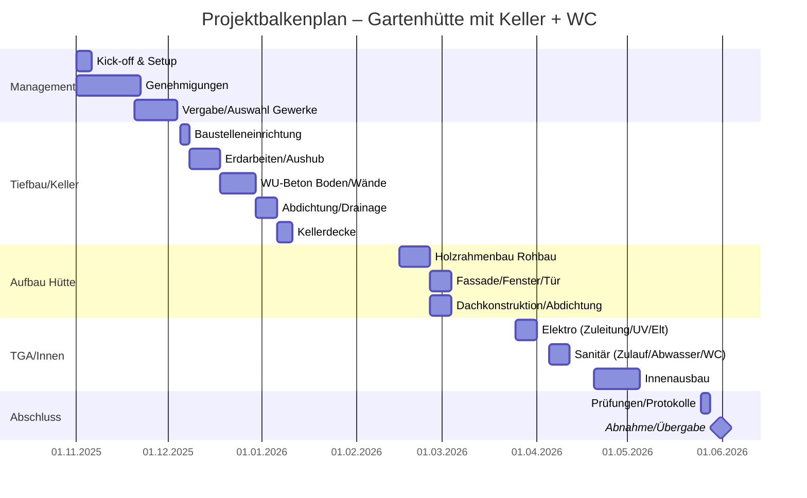
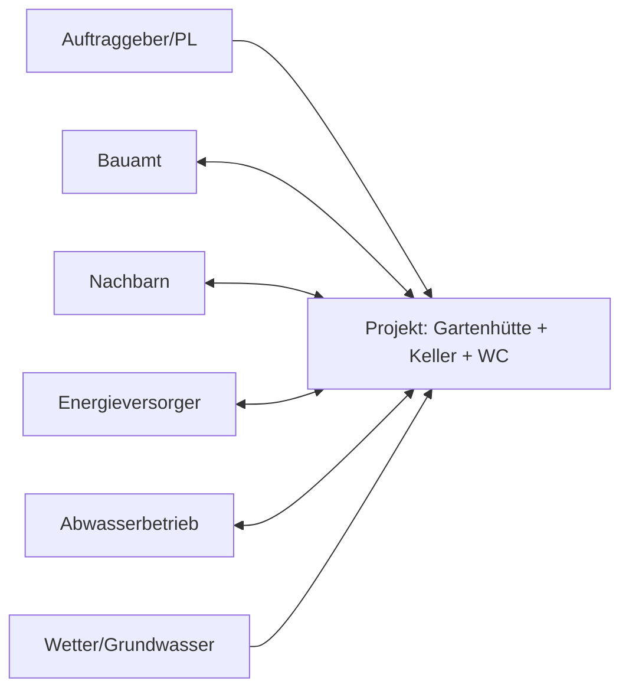
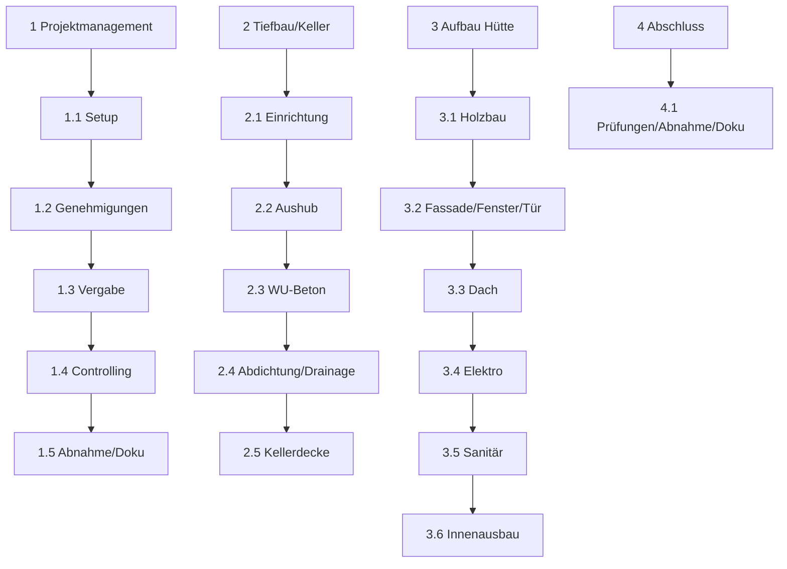

[[4.ITP2]]
___
# Projekthandbuch
Standard Projekthandbuch – 001  
Version: 0.67  
Projektleiter/in: Patrick Riedl  
Datum: 14.10.2025

Inhalt
1 Projektpläne
1.1 Projektauftrag
1.2 Projektzieleplan
1.3 Beschreibung Vorprojekt- und Nachprojektphase
1.4 Projektumwelt-Analyse
1.5 Beziehungen zu anderen Projekten und Zusammenhang mit den Unternehmenszielen (sachlicher Kontext)
1.6 Projektorganigramm
1.7 Betrachtungsobjekteplan
1.8 Projektstrukturplan
1.9 Arbeitspaket-Spezifikationen
1.10 Projektfunktionendiagramm
1.11 Projektmeilensteinplan
1.12 Projektbalkenplan
1.13 Projektpersonaleinsatzplan
1.14 Projektkostenplan
1.15 Projektkommunikationsstrukturen
1.16 Projekt-„Spielregeln“
1.17 Projektrisikoanalyse
1.18 Projektdokumentation
2 Projektstart
2.1 Protokolle – Projektstart
3 Projektkoordination
3.1 Abnahme Arbeitspakete
3.2 Protokolle – Projektkoordination
4 Projektcontrolling
4.1 Aktueller Projektfortschrittsbericht
4.2 Weitere Projektfortschrittsberichte
4.3 Protokolle – Projektcontrolling
5 Projektabschluss
5.1 Projektabschlussbericht
5.2 Protokolle – Projektabschluss

Änderungsverzeichnis
| Versionsnummer | Datum      | Änderung                                               | Ersteller       |
|----------------|------------|--------------------------------------------------------|-----------------|
| 0.67           | 14.10.2025 | Erstbefüllung des Projekthandbuchs (komplett befüllt) | Patrick Riedl   |

Ansprechpartner
| Name                         | Organisationseinheit                         | Rolle im Projekt            | Telefon          | E-Mail                                   |
|------------------------------|----------------------------------------------|-----------------------------|------------------|-------------------------------------------|
| Riedl Patrick                | —                                            | Projektleiter, Auftraggeber | +67 676767676767 | 220227@studierende.htl-donaustadt.at     |
| Magistrat – Bauamt           | Stadtverwaltung                              | Genehmigungsbehörde         | +43 1 1000 0     | bauamt@stadt.example                      |
| Abwasserbetrieb – Kundenservice | Stadtentwässerung                        | Kanalanschluss/Entwässerung | +43 1 2000 0     | kanal@stadt.example                       |
| Wasserversorger – Technik    | Stadtwerke Wasser                            | Wasseranschluss             | +43 1 3000 0     | wasser@stadtwerke.example                 |
| Energieversorger – Netz      | Netzbetreiber Strom                           | Baustrom/Zuleitung          | +43 1 4000 0     | netz@stromnetz.example                    |
| Dipl.-Ing. Max Mustermann    | Statikbüro Mustermann GmbH                   | Statik/Tragwerksplanung     | +43 1 555 11 22  | office@statik-mustermann.example          |
| Ing. Anna Beispiel           | Vermessung Beispiel KG                       | Vermessung/Absteckung       | +43 1 555 22 33  | kontakt@vermessung-beispiel.example       |
| Tiefbau Mustermann GmbH      | Tief- und Erdbau                              | Erdarbeiten/Drainage        | +43 1 700 10 10  | office@tiefbau-mustermann.example         |
| Betonbau Steiner GmbH        | Betonbau                                      | Keller WU-Beton/Decke       | +43 1 700 20 20  | kontakt@betonbau-steiner.example          |
| Zimmerei Holz&Haus OG        | Holzbau                                       | Holzrahmenbau/Fassade       | +43 1 700 30 30  | hallo@holzhau.example                     |
| Dachdeckerei Regenfest KG    | Dachdecker                                    | Dachabdichtung/Rinne        | +43 1 700 40 40  | service@regenfest.example                 |
| SHK Frisch & Klar GmbH       | Sanitär/Heizung/Klima                         | Wasser/Abwasser/WC/Hebeanlage| +43 1 700 50 50 | office@frisch-klar.example                |
| Elektro Lichtblick GmbH      | Elektroinstallationen                         | Zuleitung/UV/Licht/Steckdosen| +43 1 700 60 60 | support@lichtblick-elektro.example        |
| Entsorger CleanBox GmbH      | Container/Entsorgung                          | Entsorgung/Container        | +43 1 700 70 70  | dispo@cleanbox.example                    |
| Bodengutachter GeoCheck OG   | Geotechnik                                     | Bodengutachten/Grundwasser  | +43 1 700 80 80  | info@geocheck.example                     |
| Versicherung BauPlus AG      | Versicherung                                   | Bauwesen/Haftpflicht        | +43 1 700 90 90  | kundenservice@bauplus.example             |
| Projektcoach (optional)      | —                                              | Methodik/Review             | +43 1 123 45 67  | coach@example.org                         |

# 1 Projektpläne

## 1.1 Projektauftrag
| Feld                         | Inhalt                                                                                                                                                                                                                                                                                                                                                   |
|-----------------------------|----------------------------------------------------------------------------------------------------------------------------------------------------------------------------------------------------------------------------------------------------------------------------------------------------------------------------------------------------------|
| Projektbezeichnung          | Gartenhütte (ca. 20 m²) in Holzrahmenbau mit Keller (ca. 20 m²) und WC                                                                                                                                                                                                                                                                                   |
| Projektstartereignis        | 01.11.2025 – Startfreigabe/Genehmigung liegt vor                                                                                                                                                                                                                                                                                                         |
| Projektstarttermin          | 01.11.2025                                                                                                                                                                                                                                                                                                                                                |
| Inhaltliches Projektende    | Hütte fertiggestellt; Keller trocken, abgedichtet, zugänglich; WC funktionsfähig (geprüft); Elektro-Grundinstallation in Betrieb; vollständige Dokumentation (Pläne, Fotos, Prüfprotokolle)                                                                                                                                                                                                    |
| Formales Projektende        | Abnahmeprotokoll unterzeichnet; Bestands-/Revisionsunterlagen übergeben; Prüfprotokolle (Dichtheit Abwasser, Druckprobe Wasser, Elektro-Erstprüfung); Schlussrechnung bezahlt; Projekt archiviert                                                                                                                                                                                               |
| Zieltermine                 | Rohbau Keller inkl. Decke: 31.01.2026 • Holzbau+Dach dicht: 31.03.2026 • Sanitär/Elektro/Innenausbau: 30.05.2026 • Gesamtfertigstellung/Abnahme: 31.05.2026                                                                                                                                                                                                 |
| Projektziele (Hauptziele)   | Genehmigungskonforme Hütte; Keller in WU‑Beton, dauerhaft dicht; funktionsfähiges WC inkl. Entlüftung und Frostschutz; regendichtes Dach (EPDM/Bitumen) mit Rinne/Entwässerung; Elektro-Grundinstallation (FI/LS, Licht, mind. 4–6 Steckdosen, Außensteckdose/-licht); Einhaltung Normen/Auflagen; Termine/Budget einhalten; vollständige Abnahme/Dokumentation                                  |
| Nicht-Ziele                 | Keine Wohnnutzung/Beherbergung; keine Heizung/thermische Vollisolierung über Grundniveau; keine PV/Smart‑Home im Projektumfang; keine aufwendige Gartengestaltung über Basismaßnahmen hinaus                                                                                                                                                                                                     |
| Hauptaufgaben (Phasen)      | Planung/Statik/Genehmigungen • Baustelleneinrichtung/Vermessung • Erdarbeiten/Aushub/Entsorgung • Keller (Bodenplatte/Wände WU‑Beton, Abdichtung/Drainage, Decke) • Holzrahmenbau/Fassade/Fenster/Tür/Holzschutz • Dachkonstruktion/Abdichtung/Rinne • Sanitär (Zulauf/Abwasser/WC/Hebeanlage) • Elektro (Zuleitung/UV/Licht/Steckdosen) • Innenausbau • Außenmaßnahmen • Abnahme/Dokumentation/Übergabe |
| Ressourcen & Kosten (Plan)  | Planung/Genehmigung/Abgaben 3.500 € • Erdarbeiten/Aushub/Entsorgung 4.200 € • Keller WU‑Beton 8.000 € • Abdichtung/Drainage 2.000 € • Kellerdecke 3.000 € • Holzrahmenbau 7.000 € • Dach 2.400 € • Fenster/Tür 2.000 € • Sanitär 3.700 € • Elektro 1.600 € • Innenausbau 2.000 € • Außen 600 € • Geräte/Container 600 € • Baustelleneinrichtung 500 € • Reserve 4.110 € • Summe 45.210 € |
| Rollen/Personen             | Auftraggeber: Patrick Riedl • Projektleiter: Patrick Riedl • Projektteam: externe Gewerke gemäß Ansprechpartner                                                                                                                                                                                                                                                                                |
| Budgetkategorie             | A (bis 0,3 Mio €)                                                                                                                                                                                                                                                                                                                                         |

## 1.2 Projektzieleplan
| Zielart      | Projektziele/Anmerkungen                                                                                                                                                                                                                                                         | Adaptierte Projektziele per Entscheidung                                                                                                                                                 |
|--------------|-----------------------------------------------------------------------------------------------------------------------------------------------------------------------------------------------------------------------------------------------------------------------------------|------------------------------------------------------------------------------------------------------------------------------------------------------------------------------------------|
| Ziele        | Einbruchhemmende Tür, isolierverglaste Fenster • Leerrohre für spätere PV/Smart‑Home • Innen: Regale/Arbeitsfläche, robuster Bodenbelag • Außen: kleines Vordach, einfache Zuwegung, ggf. Regenwassernutzung für Garten (ohne WC) • Passive Kellerlüftung/Feuchteführung                                                 | Kellerlichte Höhe 2,30 m → 2,10 m (Grundwasser/Statik) • WC-Abwasser per Hebeanlage statt Freigefälle • Gründach entfällt; EPDM bleibt • Außenverkleidung Lärche statt Fichte • Reserve 10% → 12% |
| Nicht-Ziele  | Keine Wohnnutzung; keine vollwertige Heizung/Wohnraumdämmung; keine PV-/Smart‑Home‑Steuerung im Projektumfang; keine aufwendige Gartengestaltung                                                                                                                                 | —                                                                                                                                                                                        |

## 1.3 Beschreibung Vorprojekt- und Nachprojektphase
| Phase                      | Inhalte/Ergebnisse                                                                                                                                                                                                                                                                                                                                                     |
|---------------------------|---------------------------------------------------------------------------------------------------------------------------------------------------------------------------------------------------------------------------------------------------------------------------------------------------------------------------------------------------------------------------|
| Vorprojektphase           | Bedarf geklärt (Lager/Arbeitsraum + WC) • Standort inkl. Abstandsflächen/Leitungszonen festgelegt • Bauweise entschieden (Holz + Keller WU‑Beton) • Genehmigungspflicht und Auflagen geklärt • Entwässerung (Kanal, Alternative Hebeanlage) • Budget- und Terminrahmen definiert • Logistik (Zufahrt, Container) geprüft • Relevante Dokumente: Lageplan, Leitungspläne, Bodengutachten, Vorstatik, Angebote • Lessons learned aus ähnlichen Projekten berücksichtigt |
| Nachprojektphase           | Wartung: Holzschutz 3–5 Jahre; Dach/Rinnen jährlich • WC/Hebeanlage: jährliche Funktionskontrolle; Winterbetrieb (Entleerung) • As‑Built‑Dokumentation/Archivierung • 12-Monats-Mängelbegehung/Restpunkte • Optional: PV‑Insel für Licht, Regalsystem, Außenpflasterung                                                                                                                                        |

## 1.4 Projektumwelt-Analyse

Projektumwelten – Beziehungen
| Umwelten                 | Beziehung (Potential/Konflikt)                                      | Maßnahmen                                                                 | Wer / Wann (PSP Code) |
|-------------------------|------------------------------------------------------------------------|---------------------------------------------------------------------------|-----------------------|
| Bauamt                  | Genehmigung/Auflagen; Fristen                                         | Früheinreichung, vollständige Unterlagen, Nachforderungen binnen 5 AT     | PL – 1.2              |
| Nachbarn                | Lärm/Staub/Zufahrt; Akzeptanz                                         | Infobrief, Bauzeiten 08–17 Uhr, Sauberkeit, Kontakttelefon                | PL – 1.1              |
| Wasserversorger         | Hausanschluss/Wasserzähler                                            | Terminvereinbarung, Frostschutzkonzept                                    | SHK – 3.5             |
| Abwasserbetrieb         | Anschluss/Hebeanlage                                                   | Technische Abstimmung, Genehmigung Entwässerung                           | SHK – 3.5             |
| Energieversorger        | Baustrom/Zuleitungskapazität                                          | Baustrom anmelden, Provisorium planen                                     | Elektro – 3.4         |
| Statiker/Planer         | Nachweise/Detailklärungen                                              | Frühzeitige Bemusterung/Knoten, Änderungsmanagement                        | PL – 1.2              |
| Entsorger/Deponie       | Container/Abfuhrtermine                                                | Rahmenvertrag, fixe Abholtage, Trennung nach Fraktionen                   | PL – 2.1              |
| Wetter/Grundwasser      | Regen/Frost/hoher GW-Spiegel                                           | Terminpuffer, Wasserhaltung, Drainagekonzept                               | PL – 1.1              |
| Versicherung            | Schadenfälle/Bauwesen                                                  | Policen prüfen, Meldeschwellen definieren                                  | PL – 1.1              |

## 1.5 Beziehungen zu anderen Projekten und Zusammenhang mit den Unternehmenszielen

Beziehungen zu anderen Projekten
| Programme/Projekte/Kleinprojekte | Beziehung (Potential/Konflikt)              | Maßnahmen                          | Wer / Wann (PSP Code) |
|----------------------------------|----------------------------------------------|------------------------------------|-----------------------|
| Gartenorganisation/Regalsystem   | Synergien Innenausbau                        | Schnittstellen/Abmessungen klären  | Holzbau – 3.6         |
| PV‑Inselprojekt (optional)       | Vorbereitung Leerrohre                       | Leerrohre jetzt mitverlegen        | Elektro – 3.4         |
| Außenpflasterung                 | Logistik/Zufahrt                             | Reihenfolge koordinieren           | PL – 2.1              |

Zusammenhang zu den Unternehmenszielen
| Unternehmensziele                      | Beschreibung des Zusammenhangs                                                                                            |
|----------------------------------------|----------------------------------------------------------------------------------------------------------------------------|
| Werterhalt/Steigerung der Liegenschaft | Dauerhafte, genehmigungskonforme Bauausführung und vollständige Dokumentation                                            |
| Sicherheit und Compliance              | Normkonforme Elektro-/Wasser-/Abwasserprüfungen, Haftungsreduzierung                                                     |
| Effizienz/Ordnung                      | Zusätzlicher Lager-/Arbeitsraum; bessere Arbeitsabläufe im Garten                                                        |
| Nachhaltigkeit                         | Holzbau, langlebige Dachabdichtung, optionale Regenwassernutzung für Garten                                              |

## 1.6 Projektorganigramm
| Projektrolle            | Aufgabenbereiche/Skills                                                                 | Name/Unternehmen             |
|-------------------------|------------------------------------------------------------------------------------------|------------------------------|
| ProjektauftraggeberIn   | Budget/Scope/Abnahme                                                                     | Patrick Riedl                |
| ProjektleiterIn         | Planung, Koordination, Controlling, Kommunikation                                        | Patrick Riedl                |
| Projektteammitglieder   | Ausschreibung/Angebote/Terminkoordination                                                | Patrick Riedl                |
| ProjektmitarbeiterInnen | Ausführung Gewerke (Tiefbau, Beton, Holz, Dach, SHK, Elektro), Qualität/Sicherheit       | Siehe Ansprechpartner        |
| Projektcoach (optional) | Methodik, Review                                                                         | n.n.                         |

## 1.7 Betrachtungsobjekteplan
| Betrachtungsobjekt                    | Beschreibung/Abnahmekriterium                                                                 |
|--------------------------------------|-----------------------------------------------------------------------------------------------|
| Genehmigungsunterlagen               | Vollständiger Bescheid inkl. Auflagen                                                         |
| Keller (WU‑Beton)                    | Dichtes Becken, Abdichtung/Drainage, Decke gemäß Statik                                       |
| Gartenhütte (Holzrahmenbau)          | Maßhaltigkeit, Fassade/Fenster/Tür, Holzschutz                                                |
| Dach                                 | Tragwerk, EPDM/Bitumen, Rinne/Entwässerung, Dichtigkeitsprüfung                               |
| Sanitär/WC/Hebeanlage                | Dichtheits-/Druckproben bestanden, funktionsfähig                                             |
| Elektro                              | FI/LS, Beleuchtung, Steckdosen, Mess-/Prüfprotokoll                                           |
| Innenausbau                          | Dämmung leicht, Innenverkleidung, Boden                                                       |
| Dokumentation                        | Fotos, Prüfprotokolle, As‑Built‑Pläne                                                         |
| Abnahme/Übergabe                     | Abnahmeprotokoll, Restpunktliste abgearbeitet                                                 |

## 1.8 Projektstrukturplan (PSP)
| Code | Arbeitspaket/Phase                           |
|------|----------------------------------------------|
| 1    | Projektmanagement                            |
| 1.1  | Kick-off/Kommunikation/Risiko-Setup          |
| 1.2  | Genehmigungen/Behördenkommunikation          |
| 1.3  | Ausschreibung/Angebote/Vergabe               |
| 1.4  | Termin-/Kostencontrolling                    |
| 1.5  | Abnahme/Dokumentation/Übergabe               |
| 2    | Tiefbau/Keller                               |
| 2.1  | Baustelleneinrichtung/Vermessung             |
| 2.2  | Erdarbeiten/Aushub/Entsorgung                |
| 2.3  | Keller WU‑Beton (Boden/Wände)                |
| 2.4  | Abdichtung/Drainage                          |
| 2.5  | Kellerdecke                                  |
| 3    | Aufbau Hütte                                 |
| 3.1  | Holzrahmenbau Rohbau                         |
| 3.2  | Fassade/Fenster/Tür/Holzschutz               |
| 3.3  | Dachkonstruktion/Abdichtung/Rinne            |
| 3.4  | Elektro (Zuleitung/UV/Licht/Steckdosen)      |
| 3.5  | Sanitär (Zulauf/Abwasser/Hebeanlage/WC)      |
| 3.6  | Innenausbau (Dämmung/Verkleidung/Boden)      |
| 4    | Abschluss                                    |
| 4.1  | Prüfungen/Protokolle                         |
| 4.2  | Abnahme/Restpunkte                           |
| 4.3  | As‑Built‑Dokumentation/Archivierung          |

## 1.9 Arbeitspaket-Spezifikationen (Auszug vollständig befüllt)

AP 1.2 – Genehmigungen/Behördenkommunikation
| Feld                              | Inhalt                                                                                                                                              |
|-----------------------------------|-----------------------------------------------------------------------------------------------------------------------------------------------------|
| AP-Inhalt                         | Bauantrag/Bauanzeige erstellen/einreichen; Entwässerungsantrag; Abstimmung mit Kanal/Wasser; Statik bündeln; Nachforderungen fristgerecht klären  |
| AP-Nicht-Inhalte                  | Bauausführung; detaillierte Werk-/Montagepläne der Gewerke                                                                                         |
| AP-Ergebnisse                     | Genehmigungsbescheid; Auflagenliste; Startfreigabe                                                                                                 |
| AP-Leistungsfortschrittsmessung   | 25% Einreichung erfolgt • 60% Nachforderungen erledigt • 100% Bescheid erteilt                                                                     |

AP 2.3 – Keller WU‑Beton (Bodenplatte/Wände)
| Feld                              | Inhalt                                                                                                                      |
|-----------------------------------|-----------------------------------------------------------------------------------------------------------------------------|
| AP-Inhalt                         | Schalung/Bewehrung; Betonage; Fugenbänder/Durchdringungen; Nachbehandlung                                                  |
| AP-Nicht-Inhalte                  | Innenausbau; Oberflächenbeschichtung                                                                                        |
| AP-Ergebnisse                     | Dichtes Kellerbecken gemäß Statik; Maßhaltigkeit                                                                            |
| AP-Leistungsfortschrittsmessung   | 30% Schalung/Bewehrung • 70% Betonage fertig • 100% Abnahme Sicht-/Maßprüfung                                               |

AP 3.3 – Dachkonstruktion/Abdichtung
| Feld                              | Inhalt                                                                                          |
|-----------------------------------|-------------------------------------------------------------------------------------------------|
| AP-Inhalt                         | Tragwerk/Sparren; Schalung; EPDM-/Bitumenabdichtung; Dachrinne/Entwässerung                    |
| AP-Nicht-Inhalte                  | Gründach                                                                                        |
| AP-Ergebnisse                     | Regendichtes Dach; Rinne angeschlossen; Dichtigkeitsprotokoll                                   |
| AP-Leistungsfortschrittsmessung   | 50% Tragwerk montiert • 100% Dichtigkeitsprüfung bestanden                                      |

AP 3.5 – Sanitär (Zulauf/Abwasser/WC/Hebeanlage)
| Feld                              | Inhalt                                                                                                  |
|-----------------------------------|---------------------------------------------------------------------------------------------------------|
| AP-Inhalt                         | Wasserzulauf/Absperrung/Frostschutz; Abwasserleitung/Hebeanlage; WC-Montage; Dichtheits-/Druckprobe    |
| AP-Nicht-Inhalte                  | Bad-/Wellnessausbauten                                                                                  |
| AP-Ergebnisse                     | WC funktionsfähig; Prüfprotokolle vorhanden                                                             |
| AP-Leistungsfortschrittsmessung   | 30% Leitungen verlegt • 80% Geräte montiert • 100% Prüfprotokolle abgeschlossen                         |

## 1.10 Projektfunktionendiagramm (RACI-ähnlich: D=Durchführung, M=Mitarbeit, I=Information)
| PSP-Code | AP-Bezeichnung                     | Auftraggeber | Projektleiter | Tiefbau | Betonbau | Holzbau | Dach | SHK | Elektro | Entsorger |
|---------:|------------------------------------|--------------|---------------|--------:|---------:|--------:|-----:|----:|-------:|---------:|
| 1.1      | Kick-off/Setup                     | I            | D             |         |          |         |      |     |        |          |
| 1.2      | Genehmigungen                      | D            | D             |         |          |         |      |     |        |          |
| 1.3      | Vergabe                            | I            | D             | M       | M        | M       | M    | M   | M      | M        |
| 2.1      | Einrichtung/Vermessung             | I            | D             | M       |          |         |      |     |        | M        |
| 2.2      | Erdarbeiten/Aushub                 | I            | M             | D       |          |         |      |     |        | M        |
| 2.3      | Keller WU‑Beton                    | I            | M             | M       | D        |         |      |     |        |          |
| 2.4      | Abdichtung/Drainage                | I            | M             | D       | M        |         |      |     |        |          |
| 2.5      | Kellerdecke                        | I            | M             | M       | D        |         |      |     |        |          |
| 3.1      | Holzrahmenbau Rohbau               | I            | M             |         |          | D       |      |     |        |          |
| 3.2      | Fassade/Fenster/Tür/Holzschutz     | I            | M             |         |          | D       |      |     |        |          |
| 3.3      | Dach Abdichtung/Rinne              | I            | M             |         |          | M       | D    |     |        |          |
| 3.4      | Elektro                             | I            | M             |         |          |         |      |     | D      |          |
| 3.5      | Sanitär/WC/Hebeanlage              | I            | M             |         |          |         |      | D   |        |          |
| 3.6      | Innenausbau                        | I            | M             |         |          | D       |      |     |        |          |
| 4.1      | Prüfungen/Abnahme/Dokumentation    | D            | D             | M       | M        | M       | M    | M   | M      |          |

## 1.11 Projektmeilensteinplan
| PSP-Code | Meilenstein                              | Basistermin | Aktuelle Plantermine | Ist-Termine |
|---------:|------------------------------------------|-------------|-----------------------|-------------|
| M1       | Genehmigung/Startfreigabe                | 01.11.2025  | 01.11.2025            | —           |
| M2       | Aushub abgeschlossen                     | 15.12.2025  | 20.12.2025            | —           |
| M3       | Keller WU‑Beton inkl. Decke fertig       | 31.01.2026  | 31.01.2026            | —           |
| M4       | Holzbau-Rohbau steht                     | 29.02.2026  | 05.03.2026            | —           |
| M5       | Dach regendicht                          | 31.03.2026  | 31.03.2026            | —           |
| M6       | Sanitär/Elektro Rohmontage fertig        | 30.04.2026  | 03.05.2026            | —           |
| M7       | Innenausbau abgeschlossen                | 30.05.2026  | 30.05.2026            | —           |
| M8       | Gesamtfertigstellung/Abnahme             | 31.05.2026  | 31.05.2026            | —           |

## 1.12 Projektbalkenplan

## 1.13 Projektpersonaleinsatzplan
| PSP-Code | Phase/Arbeitspaket                      | Ressourcenart                | Planmenge in PT | Adaptierte Planmenge in PT | Istmenge in PT | Abweichung in PT |
|---------:|-----------------------------------------|------------------------------|----------------:|---------------------------:|---------------:|-----------------:|
| 1.1      | Kick-off/Setup                          | PL                           | 2               | 2                          | —              | —               |
| 1.2      | Genehmigungen                           | PL                           | 8               | 8                          | —              | —               |
| 1.3      | Vergabe                                 | PL                           | 5               | 5                          | —              | —               |
| 2.1      | Einrichtung/Vermessung                  | PL + Vermesser (extern)      | 2               | 2                          | —              | —               |
| 2.2      | Erdarbeiten/Aushub                      | Tiefbau (extern)             | 10              | 10                         | —              | —               |
| 2.3      | Keller WU‑Beton                         | Betonbau (extern)            | 12              | 12                         | —              | —               |
| 2.4      | Abdichtung/Drainage                     | Tiefbau (extern)             | 5               | 5                          | —              | —               |
| 2.5      | Kellerdecke                             | Betonbau (extern)            | 5               | 5                          | —              | —               |
| 3.1      | Holzrahmenbau                           | Holzbau (extern)             | 10              | 10                         | —              | —               |
| 3.2      | Fassade/Fenster/Tür                     | Holzbau (extern)             | 7               | 7                          | —              | —               |
| 3.3      | Dach                                    | Dach (extern)                | 7               | 7                          | —              | —               |
| 3.4      | Elektro                                 | Elektro (extern)             | 5               | 5                          | —              | —               |
| 3.5      | Sanitär/WC/Hebeanlage                   | SHK (extern)                 | 6               | 6                          | —              | —               |
| 3.6      | Innenausbau                             | Holzbau (extern)             | 10              | 10                         | —              | —               |
| 4.1      | Prüfungen/Doku/Abnahme                  | PL + Gewerke                 | 4               | 4                          | —              | —               |
| —        | Reserve/Unvorhergesehenes               | Divers                       | 5               | 6                          | —              | —               |
|          |                                         |                              | Summe: 103      | 104                        |                |                  |

## 1.14 Projektkostenplan
| PSP/Leistungsbereich                     | Kostenart        | Plankosten (€) | Adaptierte Plankosten (€) | Istkosten (€) | Kostenabweichung (€) |
|-----------------------------------------|------------------|----------------|----------------------------|---------------|----------------------|
| Planung/Genehmigung/Abgaben             | Fremdleistungen  | 3.500          | 3.500                      | —             | —                    |
| Erdarbeiten/Aushub/Entsorgung           | Fremdleistungen  | 4.200          | 4.200                      | —             | —                    |
| Keller WU‑Beton (Boden/Wände)           | Fremdleistungen  | 8.000          | 8.000                      | —             | —                    |
| Kellerabdichtung/Drainage               | Material+Fremd   | 2.000          | 2.000                      | —             | —                    |
| Kellerdecke                             | Fremdleistungen  | 3.000          | 3.000                      | —             | —                    |
| Holzrahmenbau Rohbau                    | Fremdleistungen  | 7.000          | 7.000                      | —             | —                    |
| Dach Abdichtung/Entwässerung            | Material+Fremd   | 2.400          | 2.400                      | —             | —                    |
| Fenster/Tür (Set)                       | Material+Fremd   | 2.000          | 2.000                      | —             | —                    |
| Sanitär (Zulauf/Abwasser/WC)            | Material+Fremd   | 3.700          | 3.700                      | —             | —                    |
| Elektro (Zuleitung/UV/Licht/Steckdosen) | Material+Fremd   | 1.600          | 1.600                      | —             | —                    |
| Innenausbau                             | Material+Fremd   | 2.000          | 2.000                      | —             | —                    |
| Außen (Holzschutz/Rinne)                | Material         | 600            | 600                        | —             | —                    |
| Geräte/Container/Entsorgung             | Sonstige         | 600            | 600                        | —             | —                    |
| Baustelleneinrichtung/Sicherheit        | Sonstige         | 500            | 500                        | —             | —                    |
| Unvorhergesehenes (Reserve)             | Reserve          | 4.110          | 5.425 (12%)                | —             | —                    |
| Summe Projekt                           | —                | 45.210         | 46.525                     | —             | —                    |

## 1.15 Projektkommunikationsstrukturen
| Bezeichnung                   | Ziele, Inhalte                                                                                         | Teilnehmer                              | Termine                          | Ort/Medium     |
|------------------------------|----------------------------------------------------------------------------------------------------------|-----------------------------------------|----------------------------------|----------------|
| Projektauftraggeber-Sitzung  | Status/Abweichungen; Entscheidungen; Freigabe Fortschrittsbericht                                       | Auftraggeber, Projektleiter             | monatlich (letzter Freitag)      | vor Ort/Video  |
| Projektcontrolling-Sitzung   | Leistung/Termine/Kosten; Risiken; Umweltbeziehungen; Soziales Controlling                               | Projektleiter, ggf. Projektcoach, Gewerke | 14-tägig                        | Video          |
| Subteam-/Gewerke-Runde       | Schnittstellen, Detailklärungen, Wochenvorschau                                                         | PL, betroffene Gewerke                  | wöchentlich (Ausführung)         | Baustelle      |
| Ad-hoc-Entscheidungen        | Dringende Entscheidungen, Change Requests                                                                | PL, Auftraggeber                        | nach Bedarf (≤48h)               | Chat/Telefon   |

## 1.16 Projekt-„Spielregeln“
| Thema        | Regel                                                                                          |
|--------------|-------------------------------------------------------------------------------------------------|
| Sicherheit   | PSA, Baustellenordnung; keine Eigenleistungen ohne Freigabe                                    |
| Qualität     | DoD je Gewerk (Maßhaltigkeit, Dichtigkeit, Prüfprotokolle)                                     |
| Kommunikation| Protokolle binnen 48h; Entscheidungen schriftlich                                               |
| Änderungen   | Change-Request mit Auswirkung auf Zeit/Kosten/Qualität; Freigabe durch AG/PL                   |
| Dokumentation| Fotos je Bauabschnitt, Prüfprotokolle, As‑Built‑Pläne                                          |
| Termine      | Bauzeiten 08–17 Uhr; Ruhezeiten respektieren                                                   |
| Umwelt       | Staub-/Lärmschutz; korrekte Entsorgung                                                          |

## 1.17 Projektrisikoanalyse
| PSP-Code | Arbeitspaket                 | Risikobeschreibung/Ursache                     | Priorität | Risikokosten (€) | Eintritt (%) | Risikowert (€) | Verzögerung (Wochen) | Präventive und korrekte Maßnahmen                                | Minimierungskosten (€) |
|---------:|------------------------------|-----------------------------------------------|----------:|-----------------:|-------------:|---------------:|---------------------:|-------------------------------------------------------------------|-----------------------:|
| 2.2      | Aushub                       | Grundwasser höher als erwartet                 | hoch      | 3.000            | 40           | 1.200          | 2                    | Wasserhaltung bereitstellen, Drainage planen                       | 800                    |
| 2.3      | WU‑Beton                     | Undichtigkeiten an Fugen/Durchdringungen      | hoch      | 4.000            | 30           | 1.200          | 2                    | Fugenbänder, qual. Überwachung, Nachinjektion als Reserve          | 1.000                  |
| 2.4      | Abdichtung/Drainage          | Verzögerte Materiallieferung                   | mittel    | 1.000            | 30           | 300            | 1                    | Alternativlieferanten, früh bestellen                               | 100                    |
| 3.1      | Holzbau                      | Witterung (Regen/Frost)                        | mittel    | 2.000            | 40           | 800            | 2                    | Terminpuffer, Abdeckung/Einhausung                                  | 400                    |
| 3.3      | Dach                          | Dichtigkeitsmangel                             | mittel    | 1.500            | 25           | 375            | 1                    | EPDM-Fachverlegung, Dichtigkeitsprüfung                             | 200                    |
| 3.4      | Elektro                       | Baustrom/Zuleitung verspätet                   | mittel    | 800              | 30           | 240            | 1                    | Frühzeitige Anmeldung, Provisorium                                  | 100                    |
| 3.5      | Sanitär/Hebeanlage            | Technische Anpassung/Genehmigung nötig         | mittel    | 1.200            | 30           | 360            | 1                    | Vorabklärung mit Betreiber, Platz/Anschluss sichern                  | 150                    |
| 1.x      | Kosten                        | Preissteigerungen                              | hoch      | 3.500            | 30           | 1.050          | 0                    | Angebote fixieren, Alternativen, Reserve 12%                         | —                      |
| 4.1      | Abnahme                       | Prüfprotokolle unvollständig                   | niedrig   | 500              | 20           | 100            | 0.5                  | Checklisten, Vorabprüfungen                                          | 50                     |

## 1.18 Projektdokumentation
| Bereich              | Beschreibung                                                                                 |
|----------------------|-----------------------------------------------------------------------------------------------|
| Ablage               | Cloud „Projekthandbuch/Gartenhütte“ + lokales Archiv                                         |
| Zugriffsberechtigung | PL Vollzugriff; Gewerke nur relevante Unterordner                                             |
| Namenskonvention     | JJJJMMTT_Kapitel_Autor_vX.Y.ext                                                               |
| Spielregeln          | Versionierung; Protokolle binnen 48h; Fotos mit Ort/Datum                                    |

# 2 Projektstart

## 2.1 Protokolle – Projektstart

Projektstart-Workshop (01.11.2025)
| Punkt        | Inhalt                                                                                  |
|--------------|------------------------------------------------------------------------------------------|
| Teilnehmer   | Auftraggeber/PL: Patrick Riedl                                                          |
| Ziele        | Scope/Termine/Kosten bestätigen; Risiken/Kommunikation festlegen                        |
| Beschlüsse   | Terminpuffer +2 Wochen; Reserve 12%; Nachbarn informieren                               |

Follow-up-Workshop (15.11.2025)
| Punkt      | Inhalt                                                                                           |
|------------|---------------------------------------------------------------------------------------------------|
| Status     | Genehmigungsunterlagen eingereicht                                                                |
| Offene Pkt | Baustrom, Containerstellplatz                                                                      |
| Maßnahmen  | Elektro meldet Baustrom bis 20.11.; Entsorger-Angebot fixieren                                    |

Projektauftraggeber-Sitzung (30.11.2025)
| Punkt     | Inhalt                                        |
|-----------|-----------------------------------------------|
| Freigaben | Vergabe Tiefbau/Beton                         |
| Budget    | Im Plan                                       |
| Risiken   | Wetterlage beobachten                         |

# 3 Projektkoordination

## 3.1 Abnahme Arbeitspakete
| PSP-Code | Arbeitspaket                         | AP-Verantwortliche/r | Datum (Plan) | Abnahme durch | Unterschrift |
|---------:|--------------------------------------|----------------------|--------------|---------------|-------------|
| 2.2      | Erdarbeiten/Aushub                   | Tiefbau Mustermann   | 20.12.2025   | AG/PL         | —           |
| 2.3      | Keller WU‑Beton                      | Betonbau Steiner     | 20.01.2026   | AG/PL         | —           |
| 2.5      | Kellerdecke                          | Betonbau Steiner     | 31.01.2026   | AG/PL         | —           |
| 3.1      | Holzrahmenbau                        | Holz&Haus OG         | 05.03.2026   | AG/PL         | —           |
| 3.3      | Dach Abdichtung/Rinne                | Regenfest KG         | 31.03.2026   | AG/PL         | —           |
| 3.4      | Elektro                              | Lichtblick GmbH      | 03.05.2026   | AG/PL         | —           |
| 3.5      | Sanitär/WC/Hebeanlage                | Frisch & Klar GmbH   | 07.05.2026   | AG/PL         | —           |
| 3.6      | Innenausbau                          | Holz&Haus OG         | 30.05.2026   | AG/PL         | —           |
| 4.1      | Prüfungen/Abnahme/Dokumentation      | PL + Gewerke         | 31.05.2026   | AG            | —           |

## 3.2 Protokolle – Projektkoordination
| Datum      | Teilnehmer/Innen                 | TOPs                                                | Entscheidungen/Maßnahmen                          |
|------------|----------------------------------|-----------------------------------------------------|---------------------------------------------------|
| wird laufend geführt | PL + betroffene Gewerke | Schnittstellen, Termine, Restpunkte                 | Protokolle in 03_Koordination                     |

# 4 Projektcontrolling

## 4.1 Aktueller Projektfortschrittsbericht per 14.10.2025
| Bereich                        | Status/Maßnahmen                                                                 |
|--------------------------------|----------------------------------------------------------------------------------|
| 1) Gesamtstatus                | Projekt planmäßig (Vorbereitung)                                                 |
| 2) Status Ziele                | Scope bestätigt; Normen/Qualität definiert; Maßnahme: DoD/Checklisten je Gewerk |
| 3) Leistungsfortschritt        | PSP-Setup 100%; Einreichung 30%; Maßnahme: Priorisierung Einreichung            |
| 4) Termine                     | Puffer +2 Wochen ergänzt; Kritischer Pfad (WU‑Beton, Dach) überwachen           |
| 5) Ressourcen/Kosten           | Im Plan; Maßnahme: Preisfixierungen einholen                                     |
| 6) Kontext                     | Nachbarinfo in Vorbereitung; Maßnahme: Versand bis 25.10.                        |
| 7) Organisation/Kultur         | Kommunikationsplan aktiv; Maßnahme: Protokollvorlagen nutzen                     |

## 4.2 Weitere Projektfortschrittsberichte
| Intervall | Empfänger        | Ablage                                   |
|-----------|------------------|------------------------------------------|
| monatlich | Auftraggeber/PL  | 04_Controlling/Berichte                  |

## 4.3 Protokolle – Projektcontrolling
| Intervall | Teilnehmer                   | Ablage                            |
|-----------|------------------------------|-----------------------------------|
| 14-tägig  | PL, ggf. Coach, Gewerke      | 04_Controlling/Protokolle         |

# 5 Projektabschluss

## 5.1 Projektabschlussbericht (Vorlage)
| Kapitel                                             | Inhalt (wird zum Projektende ausgefüllt)                 |
|-----------------------------------------------------|----------------------------------------------------------|
| 1) Gesamteindruck                                   | —                                                        |
| 2) Reflexion: Zielerreichung                        | —                                                        |
| 3) Reflexion: Leistungen/Termine                    | —                                                        |
| 4) Reflexion: Ressourcen/Kosten                     | —                                                        |
| 5) Reflexion: Interne Organisation/Umweltbeziehungen| —                                                        |
| 6) Leistungsbeurteilung (AG, PL, Gewerke)           | —                                                        |
| 7) Lessons learned                                  | —                                                        |
| 8) Nachprojektphase/Restaufgaben                    | —                                                        |

Restaufgaben/Todo-Liste (bei Abschluss)
| To-Do                         | Zuständigkeit       | Termin       |
|------------------------------|---------------------|--------------|
| —                            | —                   | —            |

9) Projektabnahme
| Rolle                | Name            | Unterschrift | Datum       |
|----------------------|-----------------|--------------|-------------|
| Projektauftraggeber  | Patrick Riedl   |              | 31.05.2026  |
| Projektleiter        | Patrick Riedl   |              | 31.05.2026  |

## 5.2 Protokolle – Projektabschluss
| Workshop                | Inhalte                                                | Ergebnis |
|-------------------------|--------------------------------------------------------|----------|
| Projektabschluss-WS     | Abnahme, Restpunkte, Archivierung, Lessons learned     | —        |

