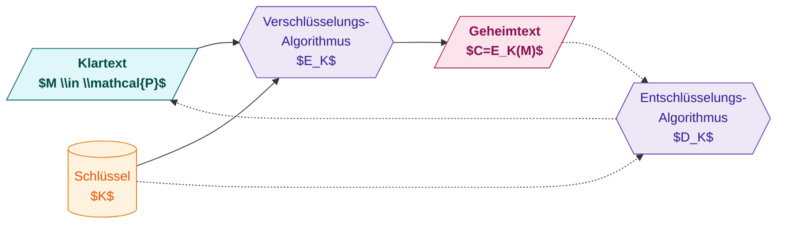
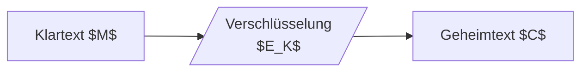
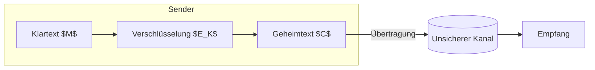
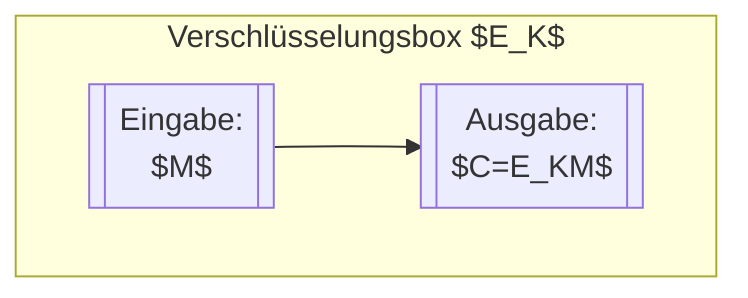

[[4.ITSI]]
___
Input ist der Klartext peP Pist die menge aller Klartexte

Kurzbeschreibung:
- $\\mathcal{P}$: Menge aller möglichen Klartexte
- $M$: konkreter Klartext
- $K$: verwendeter Schlüssel
- $E_K$: Verschlüsselungsfunktion
- $C$: resultierender Geheimtext auch Chiffre genannt (Cypher)
- (Optional) $D_K(E_K(M))=M$ bei korrekt inverser Entschlüsselung

Varianten (optional erweiterbar):
- Symmetrisch: gleicher Schlüssel $K$
- Asymmetrisch: $E_{K_{pub}}, D_{K_{priv}}$
- Authenticated Encryption: ergänzt Integrität (z.B. $C,\\text{Tag}=AE_K(M,\\text{AD})$)

Minimalvariant (nur das Gewünschte):

Alternative mit Datenflusskanal:

Falls Fokus rein auf Box-Darstellung:

Kurzer Merksatz: Eingabe $M$ fließt zusammen mit Schlüssel $K$ durch $E_K$ und ergibt $C$. Decryption (falls vorhanden) wendet $D_K$ auf $C$ an und liefert wieder $M$.