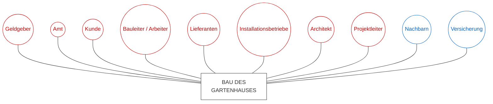

[[4.NW2]]
___
![[Wellen-5-Seepferdchen.excalidraw|1000]]

 Am Mittelpunkt (Erreger) und auf den inneren Kreisen ist die Intensität und Amplitude der Welle am höchsten, da dort die Energie konzentriert ist.
   - Mit zunehmender Entfernung nimmt die Intensität ab, die Amplitude wird kleiner, da die Energie auf eine größere Fläche verteilt wird.

