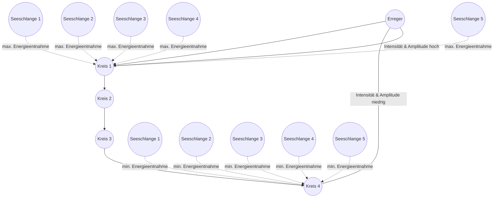

[[4.NW2]]
___

```mermaid
graph TD
    ERREGER((Erreger))
    K1((Kreis 1))
    K2((Kreis 2))
    K3((Kreis 3))
    K4((Kreis 4))

    ERREGER --> K1
    K1 --> K2
    K2 --> K3
    K3 --> K4

    %% Seeschlangen für maximale Energieentnahme (nah am Erreger)
    SMAX1((Seeschlange 1))
    SMAX2((Seeschlange 2))
    SMAX3((Seeschlange 3))
    SMAX4((Seeschlange 4))
    SMAX5((Seeschlange 5))
    SMAX1 -. "max. Energieentnahme" .-> K1
    SMAX2 -. "max. Energieentnahme" .-> K1
    SMAX3 -. "max. Energieentnahme" .-> K1
    SMAX4 -. "max. Energieentnahme" .-> K1
    SMAX5 -. "max. Energieentnahme" .-> K1

    %% Seeschlangen für minimale Energieentnahme (weit weg)
    SMIN1((Seeschlange 1))
    SMIN2((Seeschlange 2))
    SMIN3((Seeschlange 3))
    SMIN4((Seeschlange 4))
    SMIN5((Seeschlange 5))
    SMIN1 -. "min. Energieentnahme" .-> K4
    SMIN2 -. "min. Energieentnahme" .-> K4
    SMIN3 -. "min. Energieentnahme" .-> K4
    SMIN4 -. "min. Energieentnahme" .-> K4
    SMIN5 -. "min. Energieentnahme" .-> K4

    %% Annotationen zur Intensität/Amplitude
    K1 ---|"Intensität & Amplitude hoch"| ERREGER
    K4 ---|"Intensität & Amplitude niedrig"| ERREGER
```
