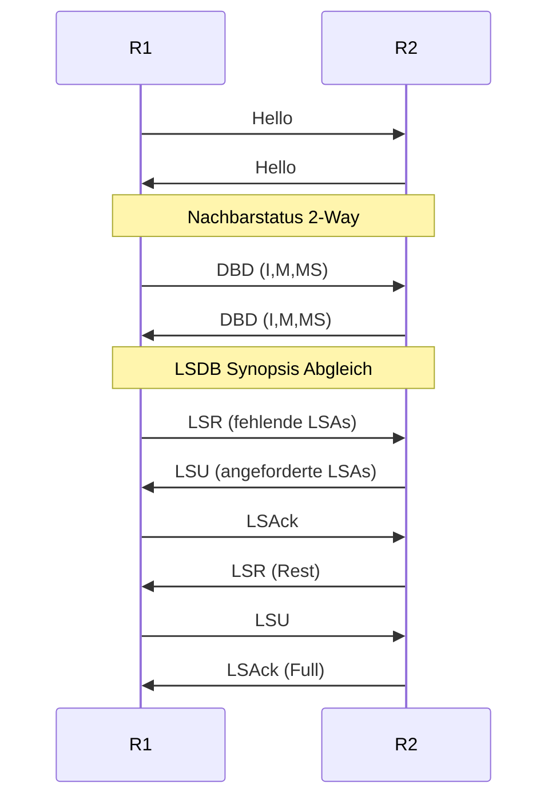
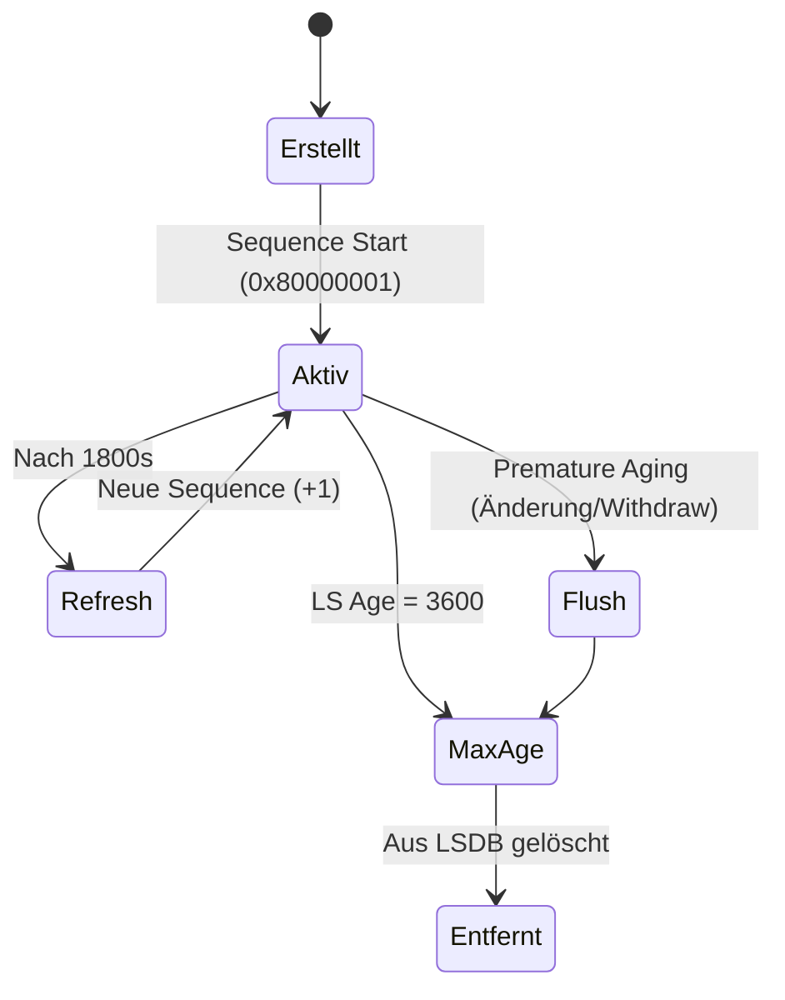
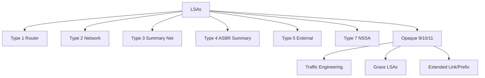

[[4.NWT]]
___
# Link State Advertisements (OSPF)

[[4.NWT]]

## 1. Begriff / Zweck
LSAs sind die internen OSPF-Dateneinheiten zur Verteilung von Topologie- und Routing-Informationen innerhalb eines definierten Flooding-Scopes (Link / Area / AS). Sie werden in der Link State Database (LSDB) gespeichert und bilden die Basis für die SPF-(Dijkstra-)Berechnung, deren Resultat der Routing-Table ist.

## 2. Allgemeiner OSPFv2 LSA-Header
| Feld | Größe | Beschreibung |
| ---- | ----- | ------------ |
| LS Age | 16 Bit | Sekunden seit Erzeugung (0–3600), MaxAge=3600 |
| Options | 8 Bit | Fähigkeits-/Feature-Bits (z.B. E, N/P, DC, L, O) |
| LS Type | 8 Bit | Typnummer (1–11, 7 etc.) |
| Link State ID | 32 Bit | Bedeutung variabel je Typ (Netz-ID, Router-ID, Präfix-ID) |
| Advertising Router | 32 Bit | Router-ID des Ursprungserzeugers |
| LS Sequence Number | 32 Bit | Versionskontrolle (0x80000001 start → +1 bis 0x7fffffff) |
| LS Checksum | 16 Bit | Fletcher-Checksum über Inhalt (ohne LS Age) |
| Length | 16 Bit | Gesamtlänge inkl. Header |

## 3. Flooding-Scopes
| Scope | OSPFv2 | OSPFv3 (Scope Bits S2/S1) | Zweck |
| ----- | ------ | ------------------------- | ----- |
| Link | Opaque Type 9 | 00 | Nur auf einem Interface |
| Area | Standard (1–5,7), Opaque 10 | 01 | Innerhalb einer Area |
| AS (Global) | Type 5,11 | 10 | AS-weit |
| Reserviert | – | 11 | Nicht genutzt |

## 4. OSPFv2 Standard LSA-Typen
| Typ | Name | Kurzbeschreibung |
| --- | ---- | ---------------- |
| 1 | Router-LSA | Links/Interfaces, Flags (V,E,B,...) |
| 2 | Network-LSA | Vom DR für Multiaccess-Netz; Liste der Router |
| 3 | Summary (Net) | ABR exportiert Prefixe in andere Areas |
| 4 | ASBR Summary | Erreichbarkeit eines ASBR |
| 5 | AS-External | Externe Routen (BGP, statisch), Typ1/Typ2-Metrik |
| 6 | MOSPF (veraltet) | Multicast (obsolet) |
| 7 | NSSA External | Externals innerhalb NSSA (später Übersetzung zu 5) |
| 8 | External Attributes | BGP-Attributtransport (praktisch obsolet) |
| 9 | Opaque (Link) | Erweiterungen (TE, GMPLS) |
| 10 | Opaque (Area) | TE LSAs etc. |
| 11 | Opaque (AS) | Erweiterungen global (z.B. Grace) |

## 5. Wichtige Erweiterungen (v2)
- Traffic Engineering LSAs (Opaque 10, strukturierte LSID)
- Grace LSAs (Graceful Restart)
- Extended Link / Extended Prefix LSAs (statt Opaque, TLV-basiert; Segment Routing etc.)

## 6. OSPFv3 Unterschiede
- LS Type strukturiert: U-Bit + Scope Bits + 13-Bit Wert
- Topologie (Router-/Network-LSAs) getrennt von Präfixen (Intra-Area-Prefix-LSA)
- Authentifizierung via IPv6/IPsec statt OSPF Header
- Link-LSA liefert Link-Local-Adresse + Options
- Erweiterungen für mehr Address Families (RFC 5838)

### Kern-LSAs (symbolisch)
| Bezeichnung | Scope | Funktion |
| ----------- | ----- | -------- |
| Router-LSA (0x2001) | Area | Topologie ohne Präfixe |
| Network-LSA (0x2002) | Area | Teilnehmer Multiaccess |
| Inter-Area-Prefix (0x2003) | Area | Prefix-Zusammenfassungen |
| Inter-Area-Router (0x2004) | Area | Erreichbarkeit zu ABR/ASBR |
| AS-External (0x4005) | AS | Externe Präfixe |
| NSSA (0x2007) | Area | Externals in NSSA |
| Link-LSA (0x0008) | Link | Interface-spezifische Daten |
| Intra-Area-Prefix (0x2009) | Area | Präfixe zu Router-/Network-LSA |

## 7. Wichtige Flags / Bits
- Router-LSA Flags: V (Virtual Link Endpoint), E (ASBR), B (ABR), NP (NSSA Translator)
- Options-Feld: E, N/P, DC, O, L, AF, R, S (je nach RFC)

## 8. SPF-Berechnung (Reihenfolge)
1. Aufbau Graph aus Router- und Network-LSAs (Intra-Area)
2. Einfügen Inter-Area (Summary) LSAs
3. Einfügen Externals (Typ 5 / 7 → 5)
4. Metrikinterpretation: Intra < Inter < External Type 1 < External Type 2  
Type 2: interne Kosten nur bis ASBR bei Gleichheit relevant

## 9. Beziehung OSPF Pakettypen ↔ LSAs
| Paket | Zweck |
| ----- | ----- |
| Hello | Nachbarerkennung, Parameterabgleich |
| Database Description (DBD) | LSDB-Synopsis Austausch |
| Link State Request (LSR) | Anforderung fehlender/älterer LSAs |
| Link State Update (LSU) | Transport von LSAs |
| Link State Acknowledgment (LSAck) | Bestätigung (explizit/implizit) |

## 10. IP Header Parameter
| Protokoll | Feld | Wert |
| --------- | ---- | ---- |
| OSPFv2 (IPv4) | Protocol | 89 |
| OSPFv2 (IPv4) | TTL | 1 |
| OSPFv2 Multicast | 224.0.0.5 / 224.0.0.6 | AllSPFRouters / AllDRouters |
| OSPFv3 (IPv6) | Next Header | 89 |
| OSPFv3 (IPv6) | Hop Limit | 1 |
| OSPFv3 Multicast | ff02::5 / ff02::6 | AllSPFRouters / AllDRouters |
| Auth | v2: Header (veraltet), v3: IPsec | Sicherheit |

## 11. OSPF Paket-Header (Kernelemente)
Version, Type, Length, Router ID, Area ID, Checksum, (v2: Auth), (v3: Instance ID).  
Typ-spezifisch:  
- Hello: Intervals, DR/BDR, Neighbor List  
- DBD: Flags I,M,MS + MTU  
- LSR: (Type, LSID, Adv Router)  
- LSU: Anzahl LSAs + LSAs  
- LSAck: LSA Header Liste  

## 12. LSA Aging & Refresh
| Mechanismus | Wert |
| ----------- | ---- |
| LS Age Inkrement | 1s |
| Refresh Intervall | 1800s |
| MaxAge | 3600s |
| Flush (Premature Aging) | Age direkt auf 3600 |
| Periodisches Re-Publish | Neue Sequence Number |

## 13. Sequence Number Handling
Start 0x80000001 → inkrement bei Änderung → Erreicht 0x7fffffff → Flush mit MaxAge → Neuaufbau ab Startwert.

## 14. Vergleich v2 vs v3 (Kurz)
| Aspekt | v2 | v3 |
| ------ | -- | -- |
| Adressierung | IPv4 im LSA | IPv6 Präfixe ausgelagert |
| Auth | OSPF Header | IPsec |
| LS Type | Flach | Scope Bits + U-Bit |
| Link-LSA | Nein | Ja |
| Mehrere AF | Opaque/Erweiterungen | RFC 5838 |

## 15. NSSA Besonderheiten
- Type 7 bleibt in NSSA
- ABR Übersetzung 7 → 5 falls P-Bit gesetzt
- Nur ein ABR übersetzt (höchste Router-ID falls nicht konfiguriert)
- Totally NSSA: Unterdrückt zusätzlich Summary (3/4) außer Default

## 16. Stub-/NSSA-Varianten
| Area-Typ | Verbotene LSAs | Default Route eingefügt | Besonderheit |
| -------- | -------------- | ----------------------- | ------------ |
| Stub | 5 | Ja (Typ 3) | Reduziert Externals |
| Totally Stubby | 5, (3/4 außer Default) | Ja | Herstellererweiterung |
| NSSA | 5 (ersetzt durch 7) | Optional | Lokale Externals |
| Totally NSSA | 5, (3/4 außer Default) | Ja | Kombination NSSA + Reduktion |

## 17. Praxispunkte
- Auto-Cost Reference-Bandwidth anpassen (sonst Gigabit=1 gleich FastEthernet)
- MTU-Mismatch → EXSTART/EXCHANGE hängt
- Incremental SPF reduziert CPU Last
- LSA Flood Control via Retransmit-Interval & Acks
- Graceful Restart über Grace LSAs
- Extended/TE/Segment-Routing LSAs erfordern Opaque/Extended Unterstützung

## 18. Adjacency Ablauf (vereinfacht)
1 Hello Austausch (Parameter, Nachbarschaft)
2 DR/BDR Wahl (Multiaccess)
3 DBD Master/Slave Aushandlung + Austausch Summary
4 LSR für fehlende LSAs
5 LSU liefert angeforderte LSAs
6 LSAck Bestätigung
7 Laufendes Flooding bei Änderungen

## 19. Häufige Fehlerbilder
| Symptom | Ursache |
| ------- | ------- |
| EXSTART/EXCHANGE Loop | MTU oder DBD Flags |
| Fehlende Externals | E-Bit mismatch oder Stub Area |
| Endlose Retransmits | Sequence/Checksum Konflikt |
| NSSA Externals fehlen | P-Bit nicht gesetzt / kein Übersetzer |
| Teilrouting fehlt | Filter / Bereichsgrenzen / Summarization |

## 20. Routingpräferenzen (typisch)
1 Intra-Area  
2 Inter-Area  
3 External Type 1  
4 External Type 2  

## 21. Metrikberechnung
| Typ | Effektive Kostenberechnung |
| ---- | ------------------------- |
| Intra / Inter | Summe OSPF Interface-Costs |
| External Type 1 | Interne Kosten bis ASBR + externe Metrik |
| External Type 2 | Externe Metrik dominiert; interne Kosten nur Tie-Breaker |
Empfehlung: Auto-Cost Reference-Bandwidth (z.B. 100000 für 100 Gbps) setzen.

## 22. Mermaid Diagramme

### 22.1 Adjacency Aufbau


### 22.2 LSA Lebenszyklus


### 22.3 Klassifikation der LSA-Typen (v2)


### 22.4 SPF Eingabe → Routing
```mermaid
flowchart LR
R1[Router-LSAs] --> G[Topologie-Graph]
N2[Network-LSAs] --> G
S3[Summary LSAs (3/4)] --> G
E5[External (5/7)] --> G
G --> SPF[Dijkstra SPF]
SPF --> RT[Routing Table]
```

## 23. Kurzer Ablauf Sequenz bei LSA Änderung
1 Änderung erkannt (Interface down / neue Route)  
2 Neue LSA Sequence = alt + 1  
3 Flood an Nachbarn (entsprechender Scope)  
4 Nachbarn prüfen: Ist neuer (Age/Seq/Checksum)? → Übernehmen + weiterflooden  
5 Acknowledgment via LSAck oder implizit durch Re-Flood Unterdrückung  

## 24. Diagnose-Hinweise (Checkliste)
| Prüfung | Warum |
| ------- | ----- |
| Area ID konsistent | Unterschied → keine Adjacency |
| Hello/Dead Interval gleich | Mismatch → Nachbarschaft scheitert |
| MTU Feld im DBD | Bei Differenz EXCHANGE Loop |
| Options Bits (E, N/P) | Stub/NSSA Konsistenz |
| Sequence Anomalien | Eventuell Flush / Neustart |
| LS Age nahe MaxAge | Braucht Refresh oder wird geflutet |
| LSA Count pro Area | Auffälliger Anstieg → Loop oder TE Flood |

## 25. Kompakte Merksätze
- OSPF berechnet Pfade nur aus Intra-Area + liefert Inter/External als Ergänzung.
- LSAs sind Status-Snapshots; Sequence + Age steuern Gültigkeit.
- Stub-Varianten reduzieren Kontroll-Plane Last durch Unterdrückung bestimmter LSAs.
- Type 2 Externals ignorieren interne Pfadkosten (außer Tie-Break).
- OSPFv3 entkoppelt Topologie (Router/Network) von Präfixen (Intra-Area-Prefix-LSA).