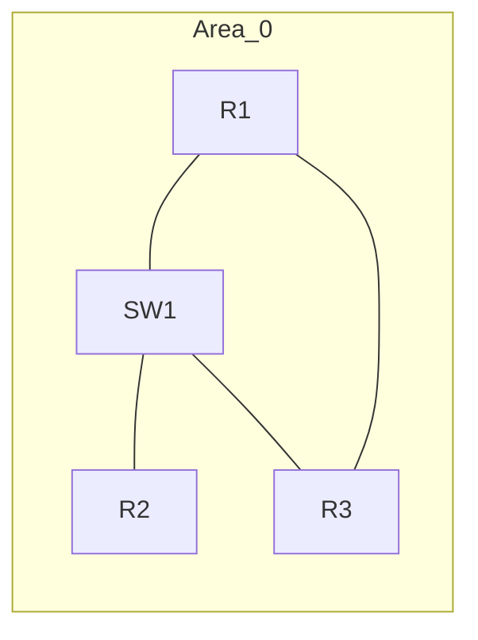

[[4.NWT]]
___
## 1. Grundlagen
- OSPF (Open Shortest Path First) = Link-State IGP, Algorithmus: Dijkstra (SPF).
- Single Area: Alle Router ausschließlich in Area 0 (Backbone) → einfache LSDB, keine ABRs.
- Multicast-Adressen: 224.0.0.5 (AllSPFRouters), 224.0.0.6 (AllDRouters).
- Metrik: Cost auf Basis Bandbreite. Formel: $Cost=\frac{Referenzbandbreite}{Interface\ Bandbreite}$
- Default Referenzbandbreite: 100 Mbps (für heutige High-Speed-Links ungenau → anpassen).
- Administrative Distance: 110.

## 2. OSPF Pakettypen
- Hello
- DBD (Database Description)
- LSR (Link State Request)
- LSU (Link State Update)
- LSAck

## 3. Relevante LSA-Typen (Single Area)
- Typ 1: Router LSA
- Typ 2: Network LSA (nur auf Multiaccess-Segment mit DR)
- Typ 3+ erst bei Multi-Area relevant

## 4. Nachbarzustände
Down → Init → 2-Way → ExStart → Exchange → Loading → Full  
(Attempt nur bei NBMA)  
- 2-Way ausreichend für DRother untereinander.
- Vollabgleich nur mit DR/BDR.

## 5. DR/BDR Wahl
- Kriterium: OSPF-Priorität (default 1, 0 = ausgeschlossen), dann höchste Router-ID.
- Router-ID-Reihenfolge: manuell gesetzt > höchste Loopback-IP > höchste aktive Interface-IP.
- Empfehlung: Manuell setzen (router-id).

## 6. Designhinweise Single Area
- Sinnvoll bis ca. ~50 Router (Faustregel).
- Alle LSAs zu allen → Skalierungsgrenzen beachten.
- Einheitliche Referenzbandbreite setzen.
- Loopbacks für stabile Router-ID.
- Passive Interfaces für Edge-Netze.

## 7. Wildcard Masks (Inverse Maske)
| Präfix | Maske | Wildcard |
|--------|-------|----------|
| /24 | 255.255.255.0 | 0.0.0.255 |
| /30 | 255.255.255.252 | 0.0.0.3 |
| /32 | 255.255.255.255 | 0.0.0.0 |

## 8. Authentifizierung
- Klartext: area 0 authentication
- MD5: area 0 authentication message-digest + ip ospf message-digest-key
- Keine native Verschlüsselung → optional IPsec.

## 9. Timer (Broadcast Default)
- Hello: 10s
- Dead: 40s
- Muss zwischen Nachbarn übereinstimmen.
- Anpassung: ip ospf hello-interval / ip ospf dead-interval (Dead meist 4x Hello)

## 10. Kostenanpassung
- Global: auto-cost reference-bandwidth (Mbps)
- Interface Override: ip ospf cost (Wert)

## 11. Beispiel-Topologie



## 12. Beispiel-Adressierung
- R1-R2: 10.0.12.0/30
- R2-R3: 10.0.23.0/30
- R1-R3: 10.0.13.0/30
- Loopbacks: R1: 1.1.1.1/32, R2: 2.2.2.2/32, R3: 3.3.3.3/32

## 13. Cisco Router Grundkonfiguration (R1 Beispiel)
```plaintext
enable
configure terminal
hostname R1
!
interface Loopback0
 ip address 1.1.1.1 255.255.255.255
!
interface GigabitEthernet0/0
 description Link to R2
 ip address 10.0.12.1 255.255.255.252
 no shutdown
!
interface GigabitEthernet0/1
 description Link to R3
 ip address 10.0.13.1 255.255.255.252
 no shutdown
!
router ospf 1
 router-id 1.1.1.1
 auto-cost reference-bandwidth 100000
 network 1.1.1.1 0.0.0.0 area 0
 network 10.0.12.0 0.0.0.3 area 0
 network 10.0.13.0 0.0.0.3 area 0
 passive-interface Loopback0
!
end
write memory
```

## 14. Interface-basierte OSPF-Konfiguration (Alternative)
```plaintext
router ospf 1
 router-id 1.1.1.1
!
interface GigabitEthernet0/0
 ip ospf 1 area 0
interface GigabitEthernet0/1
 ip ospf 1 area 0
interface Loopback0
 ip ospf 1 area 0
!
router ospf 1
 passive-interface Loopback0
```

## 15. Layer 3 Switch (Catalyst) Beispiel
```plaintext
ip routing
!
interface Vlan10
 ip address 192.168.10.1 255.255.255.0
interface Vlan20
 ip address 192.168.20.1 255.255.255.0
interface Port-channel1
 description Uplink Core R1
 ip address 10.0.50.2 255.255.255.252
!
router ospf 10
 router-id 10.10.10.10
 passive-interface Vlan10
 passive-interface Vlan20
 network 192.168.10.0 0.0.0.255 area 0
 network 192.168.20.0 0.0.0.255 area 0
 network 10.0.50.0 0.0.0.3 area 0
```

## 16. Authentifizierung MD5 Beispiel
```plaintext
router ospf 1
 area 0 authentication message-digest
!
interface GigabitEthernet0/0
 ip ospf message-digest-key 1 md5 STRONGSECRET
```

## 17. Passive Interfaces
```plaintext
router ospf 1
 passive-interface default
 no passive-interface GigabitEthernet0/0
 no passive-interface GigabitEthernet0/1
```

## 18. Summarization
- In reiner Single Area (nur Area 0) keine Area-Summaries.
- Nur sinnvoll bei Redistribution oder an Area-Grenzen (hier nicht vorhanden).

## 19. Verifikation
```plaintext
show ip ospf
show ip ospf interface
show ip ospf neighbor
show ip ospf database
show ip route ospf
show ip protocols
show ip cef 1.1.1.1
debug ip ospf adj
debug ip ospf events
undebug all
```

## 20. Troubleshooting Hinweise
- INIT State: Einseitige Hellos / Multicast gefiltert.
- EXSTART/EXCHANGE fest: MTU-Mismatch.
- Keine Routen: network/Wildcard falsch oder Interface passive.
- Duplicate Router-ID: Eine Adjazenz verweigert.
- DR ungewollt: ip ospf priority 0 setzen.
- Authentifizierungsfehler: Key/Typ stimmt nicht.
- Area-ID mismatch: Keine Nachbarschaft.

## 21. MTU Thema
- OSPF vergleicht MTU in DBD-Phase.
- Lösung: MTU angleichen oder temporär ip ospf mtu-ignore.

## 22. Kostenbeispiele (Referenzbandbreite 100000 Mbps)
- 100 Mbps: $Cost=\frac{100000}{100}=1000$
- 1 Gbps: $Cost=\frac{100000}{1000}=100$
- 10 Gbps: $Cost=\frac{100000}{10000}=10$
- 40 Gbps: $Cost=\frac{100000}{40000}=2.5$
- 100 Gbps: $Cost=\frac{100000}{100000}=1$

## 23. Loopback /32
```plaintext
interface Loopback0
 ip address 1.1.1.1 255.255.255.255
router ospf 1
 network 1.1.1.1 0.0.0.0 area 0
```
- Immer als Stub-Link in LSDB → stabil für Router-ID.

## 24. Default Route Weitergabe
```plaintext
ip route 0.0.0.0 0.0.0.0 10.0.12.2
router ospf 1
 default-information originate
```
Erzwingen ohne vorhandene Route:  
```plaintext
default-information originate always
```

## 25. Redistribution (Kurz)
```plaintext
router ospf 1
 redistribute connected subnets
```
Vorsicht: LSDB nicht unnötig aufblasen → ggf. route-map.

## 26. Konfigurations-Template (Kurzform)
```plaintext
router ospf 1
 router-id <RID>
 auto-cost reference-bandwidth 100000
 passive-interface default
 no passive-interface <Transit1>
 no passive-interface <Transit2>
 network <LoopbackIP> 0.0.0.0 area 0
 network <TransitNetz1> <Wildcard> area 0
 network <TransitNetz2> <Wildcard> area 0
```

## 27. Minimal-Interface-Modus
```plaintext
interface Gi0/0
 ip address 10.0.12.1 255.255.255.252
 ip ospf 1 area 0
interface Gi0/1
 ip address 10.0.13.1 255.255.255.252
 ip ospf 1 area 0
interface Lo0
 ip address 1.1.1.1 255.255.255.255
 ip ospf 1 area 0
router ospf 1
 router-id 1.1.1.1
```

## 28. Checkliste
- Eindeutige Router-ID?
- Referenzbandbreite angepasst?
- Passive Interfaces korrekt?
- Authentifizierung konsistent?
- MTU gleich?
- Hello/Dead identisch?
- Network/Wildcard passend?
- DR/BDR Prioritäten gesetzt?

## 29. R2 Beispiel
```plaintext
hostname R2
interface Loopback0
 ip address 2.2.2.2 255.255.255.255
interface GigabitEthernet0/0
 description Link to R1
 ip address 10.0.12.2 255.255.255.252
 no shutdown
interface GigabitEthernet0/1
 description Link to R3
 ip address 10.0.23.2 255.255.255.252
 no shutdown
router ospf 1
 router-id 2.2.2.2
 auto-cost reference-bandwidth 100000
 network 2.2.2.2 0.0.0.0 area 0
 network 10.0.12.0 0.0.0.3 area 0
 network 10.0.23.0 0.0.0.3 area 0
 passive-interface Loopback0
```

## 30. Routenprüfung
```plaintext
show ip route | include O
show ip route 1.1.1.1
show ip ospf database router
show ip ospf database network
```

## 31. OSPF Neustart
```plaintext
clear ip ospf process
```

## 32. Logging / Debug (selektiv!)
```plaintext
logging buffered 100000
debug ip ospf events
debug ip ospf adj
undebug all
```

## 33. Typische Prüfungsfragen (Stichpunkte)
- Unterschied Link-State vs Distance Vector
- Bedeutung Router-ID
- DR/BDR Wahlkriterien
- Kostenberechnung Formel
- Bedeutung 2-Way State
- Gründe fehlender Adjazenz (Hello/Dead, Auth, Area-ID, MTU, Netzmaske, Router-ID-Duplikat)

## 34. Praxis-Fokus
- Router-ID fest
- Referenzbandbreite setzen
- Passive Interfaces
- Authentifizierung falls nötig
- Kosten prüfen
- Nachbarn Full?
- LSDB / Routing-Tabelle konsistent?