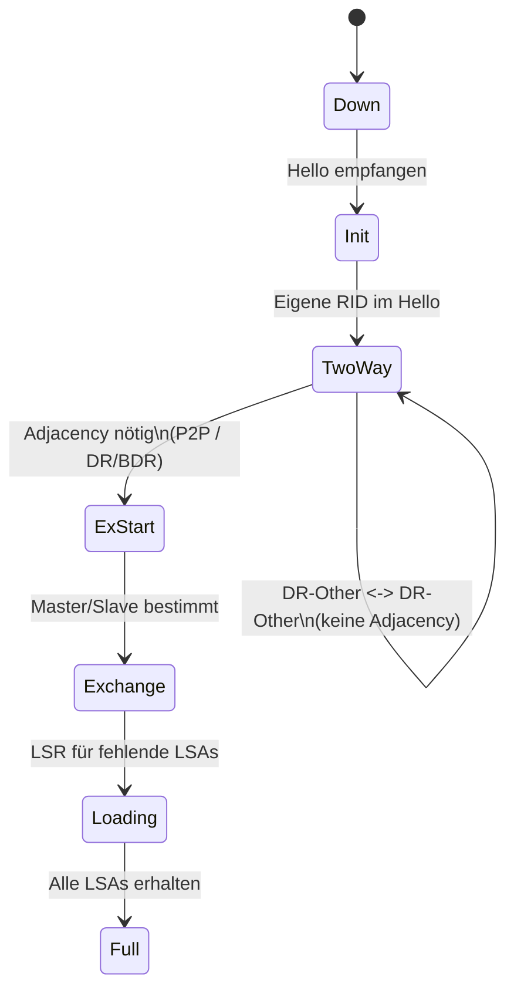

[[4.NWT]]
___
## 1. Down
- Kein Hello vom Nachbarn empfangen (Startzustand)  
- Eintrag wird nach Dead Timer entfernt (Standard: 40s bei Broadcast/P2P, 120s NBMA)  
- Transition zu Init, sobald gültiges Hello empfangen  

## 2. Attempt (nur NBMA mit manueller Nachbarkonfiguration)
- Router sendet unicast Hellos an konfigurierte Nachbarn  
- Wartet auf erstes Hello  
- Übergang zu Init bei Empfang eines Hellos  

## 3. Init
- Hello empfangen, aber eigene Router-ID (RID) fehlt noch in Nachbars Hello-Liste  
- Kommunikation noch unidirektional  
- Übergang zu 2-Way, wenn eigene RID erscheint  

## 4. 2-Way
- Bidirektionale Nachbarschaft  
- DR/BDR-Wahl auf Broadcast / NBMA Multiaccess Segmenten  
- Vollständige Adjacency nur, wenn erforderlich (P2P, Virtual Link, DR/BDR Teilnahme)  
- DR-Other zu DR-Other bleibt in 2-Way  

## 5. ExStart
- Aushandlung Master/Slave (höhere RID = Master)  
- Festlegung Initial Sequence Number für DBD-Pakete  
- Hängenbleiber oft durch MTU-Mismatch  

## 6. Exchange
- Austausch von DBD (Database Description) Paketen (nur LSA-Header)  
- Identifikation fehlender oder neuer LSAs  
- Aufbau Link State Request Liste  

## 7. Loading
- Anforderung fehlender LSAs per LSR  
- Empfang vollständiger LSAs per LSU  
- Bestätigung via LSAck  

## 8. Full
- LSDB vollständig synchron  
- Nur vollständige Adjacencies tauschen regulär LSAs (außer 2-Way auf Multiaccess)  

---

## Übergänge (regulär)
Down -> Init -> 2-Way -> (falls nötig) ExStart -> Exchange -> Loading -> Full  

## Wann entsteht eine vollständige Adjacency?
- Point-to-Point: immer  
- Point-to-Multipoint: zwischen allen Nachbarn  
- Virtual Links: immer  
- Broadcast / NBMA: nur DR <-> BDR und DR/BDR <-> DR-Other (DR-Other untereinander bleibt 2-Way)  

---

## Wichtige Begriffe
- Router ID (RID): höchstes Loopback-IP oder höchste aktive Interface-IP (oder manuell)  
- Hello Interval: Standard 10s (Broadcast/P2P), 30s (NBMA)  
- Dead Interval: 4 * Hello (i.d.R. 40s / 120s)  
- MTU-Mismatch: typischer Grund für ExStart/Exchange-Probleme  
- LSDB: Sammlung aller LSAs in einer Area  
- SPF-Lauf: Ausgelöst durch neue/geänderte LSAs (mit Throttling möglich)  

---

## OSPF Pakettypen
1. Hello  
2. DBD (Database Description)  
3. LSR (Link State Request)  
4. LSU (Link State Update)  
5. LSAck (Link State Acknowledgment)  

---

## Typische Problemzustände
- Init: Unidirektional (eigene RID fehlt im Hello)  
- 2-Way: Normal zwischen DR-Other Peers  
- ExStart/Exchange: MTU-Mismatch, Duplicate RID, ACL/Filter  
- Loading: LSRs bleiben unbeantwortet (Paketverlust)  

---

## Interface-Zustände (nicht gleich Neighbor States)
- Down  
- Loopback  
- Waiting (DR/BDR Wahl, Timer = Dead Interval)  
- Point-to-Point  
- DR Other  
- Backup DR  
- DR  

---

## DR/BDR Wahl (Broadcast / NBMA)
- Reihenfolge: 1) Höchste Priority (0 = ausgeschlossen) 2) Höchste RID  
- Keine Preemption  
- DR erzeugt Network LSA (Typ 2)  
- Priority setzen: ip ospf priority <0-255>  

---

## LSA Typen (Basis)
- Typ 1: Router LSA (area-intern)  
- Typ 2: Network LSA (vom DR)  
- Typ 3: Summary LSA (ABR -> andere Areas)  
- Typ 4: ASBR Summary (Pfad zu ASBR)  
- Typ 5: AS External (E1/E2)  
- Typ 7: NSSA External (Konvertierung zu Typ 5 auf ABR)  
- Typ 9/10/11: Opaque (z.B. TE)  

---

## Mermaid Diagramm Nachbarzustände


---

## Fehlersuche Checkliste
- show ip ospf neighbor (State korrekt?)  
- show ip ospf interface (Netztyp, Timer, Priority)  
- MTU vergleichen (show interface / debug ip ospf adj)  
- Duplicate RID? (show ip ospf)  
- Multicast 224.0.0.5 / 224.0.0.6 geblockt?  
- ACL / Firewall / VRF / Passive Interface prüfen  

---

## Typische Cisco Konfigurationen
Interface Timer (nur bei Bedarf):
```
interface GigabitEthernet0/0
 ip ospf hello-interval 5
 ip ospf dead-interval 20
```

Priority setzen:
```
interface GigabitEthernet0/0
 ip ospf priority 100
```

Passives Interface:
```
router ospf 10
 passive-interface GigabitEthernet0/2
```

Router ID festlegen:
```
router ospf 10
 router-id 1.1.1.1
```

NBMA manuelle Nachbarn:
```
interface Serial0/0
 ip ospf network non-broadcast
 neighbor 10.1.1.2 priority 50
```

---

## Templater Vorlage (OSPF Nachbarschaftsanalyse)
```tpl
# OSPF Nachbarschaftsanalyse - <% tp.date.now("YYYY-MM-DD HH:mm") %>

## Interface
Name: <% tp.system.prompt("Interface?") %>
Netztyp: 
Hello/Dead: 
Priority: 
DR/BDR: 

## Nachbarn
| RID | State | Priority | DR/BDR Rolle | Letztes Hello |
|-----|-------|----------|--------------|---------------|

## Diagnose
State hängen geblieben in: 
Mögliche Ursache: 
MTU Vergleich: 
ACL/Firewall Check: 
RID Konflikte: 

## Aktionen
- 
- 

## Nächster SPF Lauf beobachtet um:
```

---

## Eselsbrücke Reihenfolge
D I 2 E E L F  
Down, Init, 2-Way, ExStart, Exchange, Loading, Full  

---

## Kompakte Lernfassung
- Down: kein Hello  
- Init: Hello da, keine Bidirektionalität  
- 2-Way: Bidirektional, ggf. Endzustand (DR-Other)  
- ExStart: Master/Slave Aushandlung  
- Exchange: DBD Austausch  
- Loading: LSR/LSU Phase  
- Full: LSDB synchron