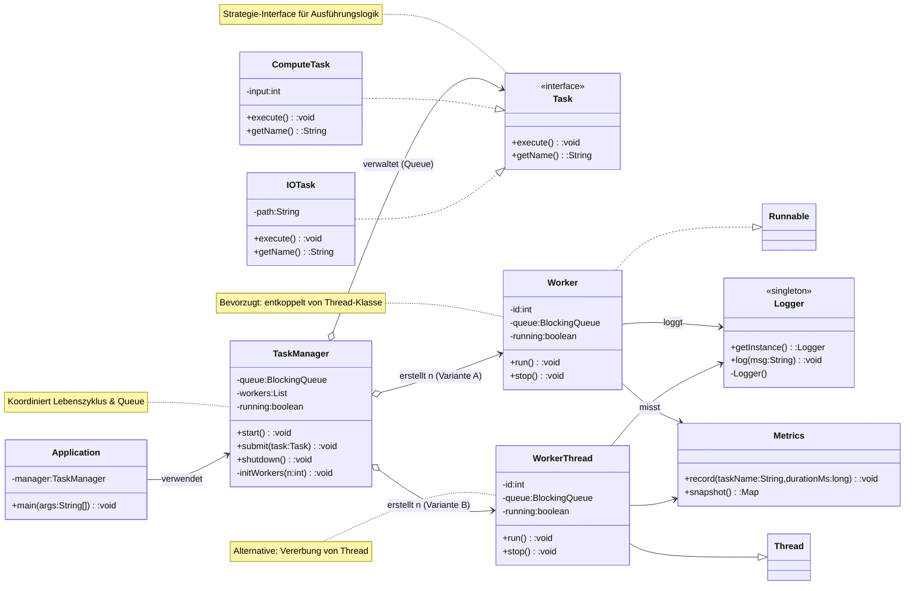

[[4.SEW]]
___
Prozess besteht aus verschiedenen Threads die parralell ablaufen.

Wie macht man das in Java?
Es gibt eine Klasse die thread heißt
```java
// Kleinster verständlicher Thread-Einsatz in Java

// 1. Erzeuge einen Thread: Übergib ein Runnable (hier als Lambda) + optional einen Namen.
Thread arbeiter = new Thread(
    () -> {
        // Dieser Code läuft PARALLEL zum Haupt-Thread (main)
        System.out.println("Arbeite in: " + Thread.currentThread().getName());
        try {
            Thread.sleep(300); // simuliert kurze Aufgabe (ohne CPU zu blockieren)
        } catch (InterruptedException e) {
            Thread.currentThread().interrupt(); // guter Stil bei Abbruch
        }
        System.out.println("Fertig: " + Thread.currentThread().getName());
    },
    "Arbeiter-1" // Thread-Name (hilfreich fürs Debugging)
);

// 2. Starten: start() startet einen NEUEN Ausführungsstrang und ruft intern run() auf.
// (run() NIEMALS direkt aufrufen, sonst läuft es nur im aktuellen Thread!)
arbeiter.start();

// 3. Optional warten, bis dieser Thread fertig ist (Synchronisation)
// Ohne join() würde main evtl. früher enden.
arbeiter.join();

// 4. Danach ist garantiert: der oben definierte Codeblock wurde vollständig ausgeführt.
System.out.println("Main: Arbeiter-Thread abgeschlossen.");
```



Kurzbeschreibung:
- Application: Einstieg, richtet TaskManager ein.
- TaskManager: Startet Worker, nimmt Tasks entgegen, verwaltet Queue und Shutdown.
- Task (Interface): Abstrakte Arbeitseinheit (Strategy).
- ComputeTask / IOTask: Konkrete Implementierungen.
- Worker (Runnable): Holt Tasks aus Queue und führt aus (empfohlene Variante).
- WorkerThread (extends Thread): Alternative falls direkte Thread-Spezialisierung nötig.
- Logger (Singleton): Zentrale Protokollierung.
- Metrics: Laufzeitmessung / Monitoring.
- Queue (BlockingQueue): Entkopplung zwischen Produzenten (submit) und Konsumenten (Worker).